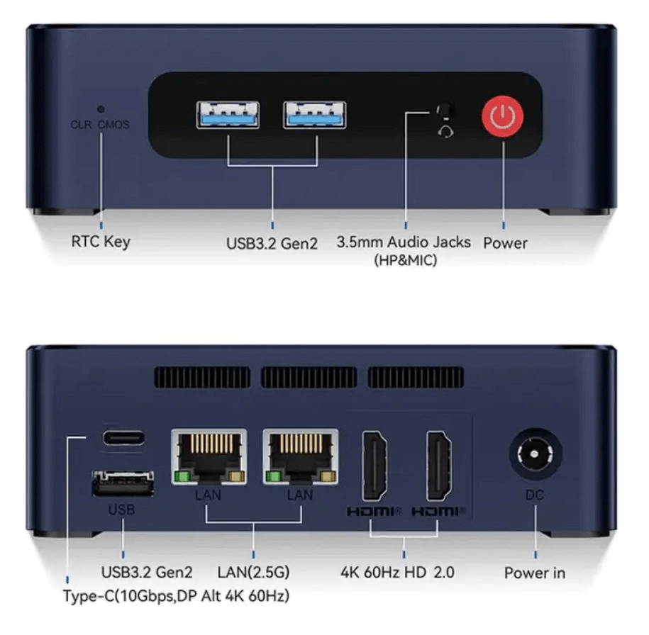
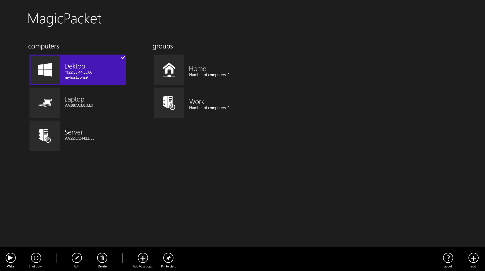
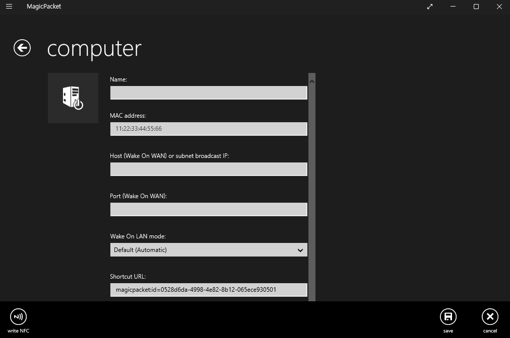
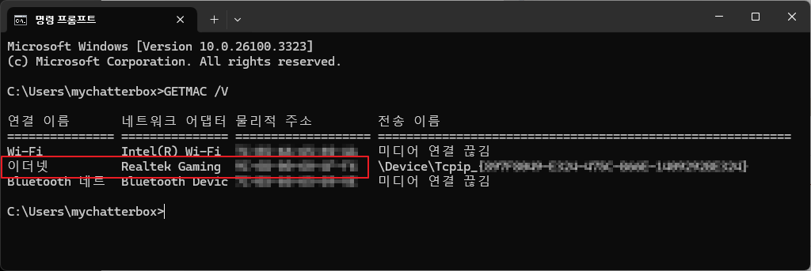

많은 n100 미니pc 중의 하나인 `Beelink EQ12` 모델입니다.  
[PD 충전기](https://chatter.kr/minipc-pdcharger) 에 연결해서 잘 사용해왔고 문제가 없었기 때문에 이제는 보이지 않는 곳에 두고 wake on lan 기능으로 사용해보려고 합니다.

Beelink 미니pc 모델들이 wol 기능이 되는지 검색해보면 의외로 정보가 별로 없습니다.  
공식 포럼에도 글이 별로 없으며, 이메일로 문의하면 설명서를 보내주겠다 정도의 답변만 달리는 것 같습니다.

>결론부터 말하면 Beelink EQ12 모델은 wake on lan 기능이 기본으로 설정되어 있으며 바이오스에서 특별히 설정할 것이 없습니다.

문제는 제가 사용하는 헬로비전 공유기(머큐리 MC-G500)에는 따로 WOL 기능이 없네요?  
와 뭐지 WOL 안되는 공유기도 있나?  
뭐 그런데 결과적으로는 아무 상관이 없었습니다.  

아래와 같은 간단한 WOL 프로그램을 사용합니다.  
[MagicPacket](https://apps.microsoft.com/detail/9wzdncrcw1mx?hl=ko-kr&gl=KR) 

Name:  
PC 이름을 입력합니다.  
MAC address:  
아래와 같이 CMD 창에서 `getmac /v` 명령어로 MAC 주소를 확인하고  
3C-6P-10-30-4G-F3 형식으로 보이면 3C:6P:10:30:4G:F3 처럼 입력합니다.  
2가지 정보만 입력해도 WOL 기능이 잘 작동합니다. 

