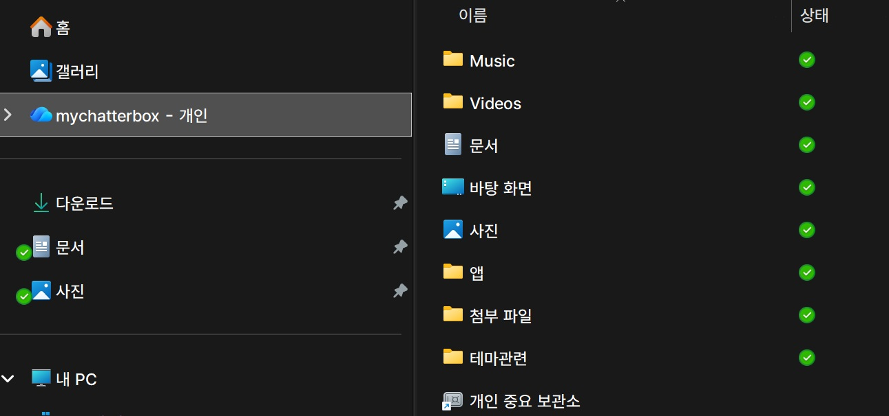

  

탐색기에서 OneDrive 를 클릭해도 아무런 반응이 없고, 우클릭-속성을 확인하면 빈 칸으로 표시되나요?  
OneDrive 폴더 위치를 변경했나요?  
혹시 윈도우 LTSC 사용중인가요?  

### 원인  
문제는 레지스트리 구성이 누락된 데 있습니다.  
개인 OneDrive 계정을 설정할 때 OneDrive 클라이언트는 탐색기 아이콘을 실제 OneDrive 폴더에 연결하기 위해 {A52BBA46-E9E1-435f-B3D9-28DAA648C0F6} CLSID를 등록해야 합니다.

Windows LTSC 에서는 이 등록 단계가 수행되지 않을 수 있습니다. 따라서 파일 탐색기에 아이콘은 나타나지만 OneDrive 폴더를 열 수 있는 기능은 없습니다.  

### 해결 과정

1. 레지스트리 파일 만들기  
    메모장에서 아래 내용을 OneDriveFix.reg 와 같은 이름으로 저장합니다.  

    ```reg file="OneDriveFix.reg"
    Windows Registry Editor Version 5.00

    [HKEY_LOCAL_MACHINE\SOFTWARE\Microsoft\Windows\CurrentVersion\Explorer\FolderDescriptions\{5E6C858F-0E22-4760-9AFE-EA3317B67173}]
    "Category"=dword:00000002
    "Name"="Profile"

    [HKEY_LOCAL_MACHINE\SOFTWARE\Microsoft\Windows\CurrentVersion\Explorer\FolderDescriptions\{A52BBA46-E9E1-435f-B3D9-28DAA648C0F6}]
    "Attributes"=dword:00000001
    "Category"=dword:00000004
    "DefinitionFlags"=dword:00000040
    "Icon"=hex(2):25,00,53,00,79,00,73,00,74,00,65,00,6d,00,52,00,6f,00,6f,00,74,     00,25,00,5c,00,73,00,79,00,73,00,74,00,65,00,6d,00,33,00,32,00,5c,00,69,00,     6d,00,61,00,67,00,65,00,72,00,65,00,73,00,2e,00,64,00,6c,00,6c,00,2c,00,2d,     00,31,00,30,00,34,00,30,00,00,00
    "LocalizedName"=hex(2):40,00,25,00,53,00,79,00,73,00,74,00,65,00,6d,00,52,00,     6f,00,6f,00,74,00,25,00,5c,00,53,00,79,00,73,00,74,00,65,00,6d,00,33,00,32,     00,5c,00,53,00,65,00,74,00,74,00,69,00,6e,00,67,00,53,00,79,00,6e,00,63,00,     43,00,6f,00,72,00,65,00,2e,00,64,00,6c,00,6c,00,2c,00,2d,00,31,00,30,00,32,     00,34,00,00,00
    "LocalRedirectOnly"=dword:00000001
    "Name"="OneDrive"
    "ParentFolder"="{5E6C858F-0E22-4760-9AFE-EA3317B67173}"
    "ParsingName"="shell:::{018D5C66-4533-4307-9B53-224DE2ED1FE6}"
    "RelativePath"="OneDrive"
    ```

2. 레지스트리 수정  
    만약 OneDrive 의 폴더 위치를 C:\Users\계정명\OneDrive 에서 다른 폴더로 변경했다면 조금 수정합니다.  

    - 사용자 폴더 내 동일한 위치에서 이름만 바뀐 경우  
      예시 : C:\Users\계정명\OneDrive -> C:\Users\계정명\backup   
      수정 : "RelativePath"="OneDrive" -> "RelativePath"="backup"  

    - 다른 드라이브 혹은 사용자 폴더가 아닌 곳으로 이동한 경우  
      예시 : D:\OneDrive  
      수정 : "ParentFolder"="{5E6C858F-0E22-4760-9AFE-EA3317B67173}"  라인 삭제  
      수정 : "RelativePath"="OneDrive" -> "RelativePath"="D:\OneDrive"  

3.  OneDriveFix.reg 파일을 더블클릭해서 레지스트리를 업데이트 합니다.  

4. 작업관리자 - 프로세스 탭에서 'Windows 탐색기' 우클릭 - 다시 시작


> [!Info|hide]  
> 출처 : https://rentry.org/od_problem