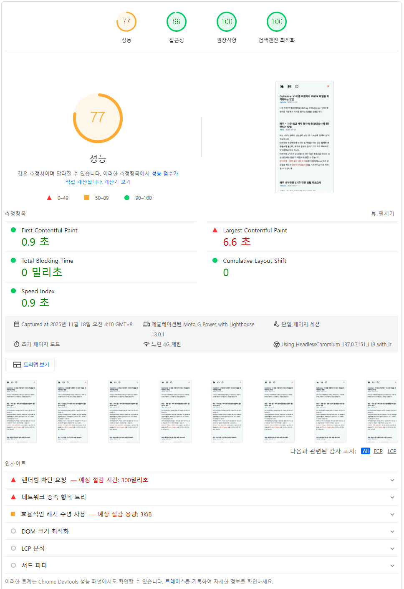
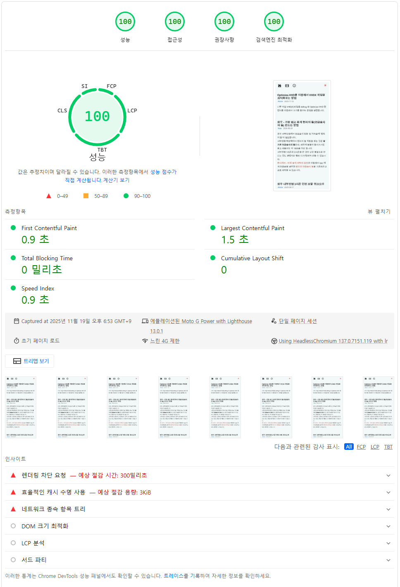

### 수정하기 전



<hr>

### 상태 파악

이 사이트는 Github --> Cloudflare 를 통해 배포하고 있습니다.  
실제 사용자들의 LCP 점수는 괜찮은 편이겠지만 PageSpeed 테스트는 '느린 4G 제한' 환경이라 좋은 점수를 받기가 어렵습니다.  

인사이트 내역을 살펴봐도 의심스러운 내용이 없습니다.  
font-display: swap; 같은 기본적인 설정은 해둔 상태에서, Pretendard 폰트의 가변 다이나믹 서브셋을 preload 로도 불러보고, 로컬에 저장해서 로컬 폰트를 바로 불러오는 방식도 써보지만 결과는 별 차이가 없습니다.  
가변 다이나믹 서브셋을 잘 설정할 경우 LCP가 3초대로 낮아지긴 하지만 FCP가 3초대로 증가해서 최종 점수는 별 차이가 없습니다.  

pagespeed lcp fcp 최적화, 뭐 이런 단어로 검색을 많이 해보고 살펴봐도 다 비슷한 얘기이고, 유명한 <mark>[AstroPaper](https://astro-paper.pages.dev/)</mark> 테마를 살펴봐도 코드에 특이한 점은 없었습니다. 그런데 AstroPaper의 PageSpeed FCP, LCP 점수는 100점입니다. 이유가 뭘까.

아! 폰트다. 그냥 사용자 기기의 폰트를 쓰도록 했구나.

### 테스트

일단 무식하게 font.css 파일과 폰트 설정을 전부 제거하고 크롬 DevTools 의 Lighthouse 로 테스트 해봅니다.  
이때 네트워크 속도는 Slow 4G 로 설정해야 실제 PageSpeed 테스트와 비슷한 결과를 얻을 수 있습니다.  
오! 100점이 나옵니다.  
역시 폰트가 문젠데, 그렇다면 이제 원하는 Pretendard 폰트를 어떻게 사용해야 하나...


### 타협

Pretendard 폰트가 없는 기기에서는 어떻게 보일지 생각해봅니다.  
브라우저의 폰트를 변경하지 않은 기본 설정인 상태에서는 PC는 맑은 고딕, 맥은 Apple SD Gothic Neo, 모바일은 해당 OS의 기본 폰트로 보이겠지요.  
폰트를 이미 설치하고 브라우저의 폰트를 따로 설정한 경우 해당 폰트를 보여주므로 내가 생각한 우선 순위대로 설정합니다.  


```css file="global.css"
:root {
--font-sans: 'Pretendard GOV Variable', 'Pretendard GOV', 'Pretendard', 'Noto Sans KR', 'OneUI Sans', sans-serif;
--font-mono: 'Cascadia Code', 'Noto Sans Mono', 'Roboto Mono' monospace;
}
```

### 최종 결과


