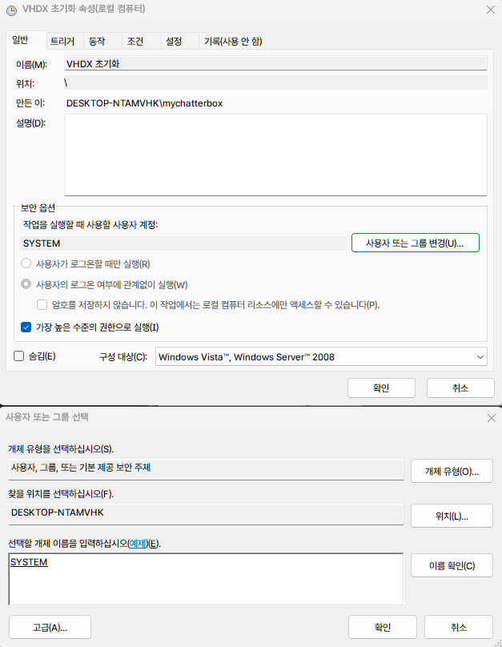
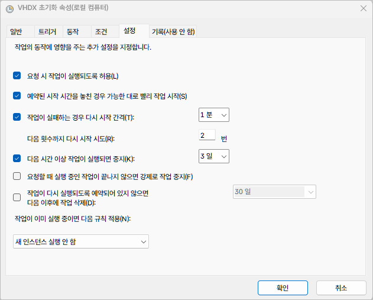

기본적으로는 vhdx 기준이며 윈도우를 vhd 혹은 vhdx로 설치하는 방법은 생략하겠습니다.  

vhd 혹은 vhdx를 사용할 정도면 사실 이렇게 자동으로 강제 초기화하는 방법까지 사용할 필요는 없는데, 컴퓨터를 공유하는 사람들 때문에 이런 환경이 필요할 수도 있겠다 싶습니다.  
다만, 그분들이 나중에 사용할지도 모를 자료를 C가 아닌 다른 드라이브에 저장할 수 있나요?  

**c:\Users\계정명\Downloads** 이런 폴더를 다른 드라이브에 심볼릭링크로 만들거나, 원드라이브를 잘 활용하면 이런 문제를 해결할 수 있는데, 그런건 됐고! 하시면 아래 방법을 사용해보세요.  

실제 사용 환경에서 아래 두 가지가 가장 중요할 겁니다.  

> [!NOTE|hide]  
> PC를 켜거나 재부팅하면 자식으로 부팅되고 항상 초기화된 상태여야 한다.  
> 부팅 과정에서 부트 메뉴를 선택할 수는 있지만, 일부러 선택할 필요는 없다.   

자동 실행 스크립트를 만들어서 부팅될 때마다 다음 부팅될 자식을 새롭게 만들고 새로운 자식을 부팅 대상이 되도록 하면 되겠죠.  
아래 방식은 자식 _C1 <==> _C2가 순환하는 구조입니다.  

> [!IMPORTANT|hide] 
> 스크립트가 부모 vhdx를 수정하지는 않지만 다시 한 번 백업하고, bcd 파일도 백업하면 좋습니다.  

---

## 스크립트 저장  

부모 vhdx로 부팅한 상태에서 작업합니다.  

아래 스크립트를 UTF8 + BOM 형식으로 저장합니다.  
(윈도우 11 기본 메모장에서는 다른 이름으로 저장 - 아래쪽 인코딩 UTF8(BOM) 선택)

> [!TIP|hide] 
> 각자 환경이 다르기 때문에 설정값 항목들을 본인의 환경에 맞게 수정해야 합니다.  
> BOOTICE 프로그램 - BCD 탭에서 OS GUID 를 쉽게 확인할 수 있습니다.  

아래 예시에서는 vhdx 파일과 스크립트가 모두 I:\VHDX 폴더에 있다고 가정합니다.  
저는 bootice로 자식을 만들거나 병합하기 때문에 자식의 이름은 뒤에 _C1, _C2가 추가되는 형태입니다.  
반드시 다른 이름이어야 한다면 그에 맞게 스크립트를 수정해야 합니다.   


```ps file="reset_vhdx.ps1"
# =====================================================
# 설정값
# =====================================================

$C1_GUID     = "{0b44e3e0-9518-4646-bba1-b75628ccfc48}".ToLower()
$C2_GUID     = "{a2c418f9-a7ec-4998-9edb-09c7facfe017}".ToLower()
$PARENT_GUID = "{0ba37a8d-f525-11ef-8d58-7cb56665694e}".ToLower()

$ParentPath = "I:\VHDX\Windows 11.vhdx"
$C1_Path    = "I:\VHDX\Windows 11_C1.vhdx"
$C2_Path    = "I:\VHDX\Windows 11_C2.vhdx"

$BootTimeout = 20
$LogPath     = "I:\VHDX\reset_log.txt"

# =====================================================
# 공통 함수
# =====================================================

function Write-Log {
    param([string]$Message)
    $time = Get-Date -Format "yyyy-MM-dd HH:mm:ss"
    $line = "$time | $Message"
    Add-Content -Path $LogPath -Value $line
    Write-Host $line
}

# 현재 부팅 슬롯 판별 (description 기준)
function Get-CurrentSlot {

    $lines = & bcdedit.exe /enum "{current}"

    foreach ($line in $lines) {
        if ($line -like "*_C1*") { return "C1" }
        if ($line -like "*_C2*") { return "C2" }
    }

    return "UNKNOWN"
}

# Differencing VHDX 재생성
function Reset-DifferencingVHDX {
    param([string]$TargetPath)

    $backup = "$TargetPath.old"

    try {
        if (Test-Path $backup) {
            Remove-Item $backup -Force
        }

        if (Test-Path $TargetPath) {
            Rename-Item $TargetPath $backup
        }

        $dp = @"
create vdisk file="$TargetPath" parent="$ParentPath"
exit
"@

        $dp | diskpart | Out-Null

        if (-not (Test-Path $TargetPath)) {
            throw "VHDX 생성 실패"
        }

        Remove-Item $backup -Force
        return $true
    }
    catch {
        Write-Log "VHDX 재생성 오류: $_"

        if (Test-Path $backup -and -not (Test-Path $TargetPath)) {
            Rename-Item $backup $TargetPath
            Write-Log "백업 VHDX 복구 완료"
        }
        return $false
    }
}

# 부트 메뉴 순서 고정 (현재 OS는 1번에 두지 않음)
function Update-BootMenuOrder {
    param (
        [string]$First,
        [string]$Second,
        [string]$Third
    )

    $raw = (bcdedit /v /enum {bootmgr} | Out-String)

    if ($raw -match '(?s)(?:displayorder|표시순서)\s+(.+?)(?=\r?\n[a-z]|$)') {

        $all = [regex]::Matches($Matches[1], '\{[a-fA-F0-9-]{36}\}') |
               ForEach-Object { $_.Value.ToLower() }

        $others = $all | Where-Object {
            $_ -ne $C1_GUID -and $_ -ne $C2_GUID -and $_ -ne $PARENT_GUID
        }

        # 기존 displayorder 초기화
        bcdedit /deletevalue {bootmgr} displayorder 2>$null | Out-Null

        # 새 순서 적용
        foreach ($g in @($First, $Second, $Third) + $others) {
            bcdedit /displayorder $g /addlast | Out-Null
        }

        Write-Log "부트 메뉴 순서 적용 완료"
    }
}

# =====================================================
# 메인 로직
# =====================================================

Write-Log "=== VHDX 순환 시스템 시작 ==="

# 1) 부트 메뉴 강제 표시 + timeout
try {
    bcdedit /set {bootmgr} displaybootmenu yes | Out-Null
    bcdedit /set {bootmgr} bootmenupolicy Standard | Out-Null
    bcdedit /timeout $BootTimeout | Out-Null
    Write-Log "부트 메뉴 표시 및 timeout 설정 ($BootTimeout 초)"
}
catch {
    Write-Log "부트 메뉴 설정 실패: $_"
}

# 2) 현재 슬롯 판별
$currentSlot = Get-CurrentSlot
Write-Log "현재 부팅 슬롯: $currentSlot"

# ⚠️ 핵심: 현재 실행 중인 엔트리는 displayorder 1번에서 제거
bcdedit /displayorder {current} /remove 2>$null | Out-Null

# 3) 순환 로직
if ($currentSlot -eq "C1") {

    Write-Log "C1 부팅 → C2 초기화"

    if (Reset-DifferencingVHDX -TargetPath $C2_Path) {
        bcdedit /default $C2_GUID | Out-Null
        Update-BootMenuOrder -First $C2_GUID -Second $C1_GUID -Third $PARENT_GUID
        Write-Log "C2 초기화 완료, 다음 부팅은 C2"
    }

}
elseif ($currentSlot -eq "C2") {

    Write-Log "C2 부팅 → C1 초기화"

    if (Reset-DifferencingVHDX -TargetPath $C1_Path) {
        bcdedit /default $C1_GUID | Out-Null
        Update-BootMenuOrder -First $C1_GUID -Second $C2_GUID -Third $PARENT_GUID
        Write-Log "C1 초기화 완료, 다음 부팅은 C1"
    }

}
else {
    Write-Log "부모 또는 기타 OS 부팅 → 순환 로직 미수행"
}

Write-Log "=== VHDX 순환 시스템 종료 ==="

```

## 스크립트를 작업 스케줄러에 등록  

작업 스케줄러 - 동작 - 작업 만들기  

- 일반
    

- 트리거 : 시스템 시작 시
- 동작  
  - 동작 : 프로그램 시작
  - 프로그램/스크립트 : powershell.exe
  - 인수 추가(옵션) : -NoProfile -ExecutionPolicy Bypass -File "I:\VHDX\reset_vhdx.ps1"  
- 조건 : 그대로 유지하거나, 전부 해제
- 설정 : 반드시 이대로 해야되는 것은 아닙니다.  
  

## 결과 확인  

이제 PE 혹은 다른 윈도우로 부팅해서 자식을 만들고 재부팅 몇 번 해봅니다.  

윈도우 바탕화면에 진입하면 다른 시작 프로그램들이 먼저 시작되고, 몇 초 후 스크립트가 실행됩니다.  
스크립트는 숨겨진 상태로 실행되므로 powershell 창이 보이지 않아야 합니다.  
C1로 부팅한 상태라면 스크립트가 실행된 후 _C2.vhdx 파일의 크기가 4MB로 초기화 되어야 합니다.  

C1 -> C2 재부팅하면 비록 C2가 부트메뉴의 첫 줄로 이동하지는 않지만 C2가 기본 선택된 상태로 표시되어야 합니다.  

스크립트가 기존에 존재하던 다른 부트메뉴를 삭제하거나 수정하지 않아야 합니다.  