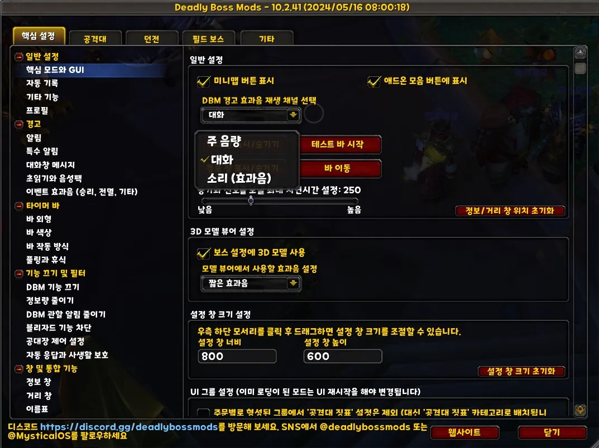

/dbm 으로 옵션창을 열고 <mark>일반 설정-핵심 모드와 GUI</mark> 탭을 들어가면 아래 스크린샷처럼 </mark>DBM 경고 효과음 재생 채널 선택</mark> 이라는 옵션이 있습니다.  
아래 스크린샷을 참고하셔서 각자 설정에 맞게 소리 크기를 설정하세요.  
아래 예시는 대화 채널로 설정했는데, 여기서 '대화' 채널이라는 것은 게임 내 npc 대사를 말하므로 혹시 대화 채널로 설정하고 볼륨을 낮추면 npc 대사가 작게 들립니다.  
이리저리 테스트해보니 주음량으로 설정하고, 주음량을 낮추고 다른 소리를 키우는 것이 좋은 것 같습니다.

