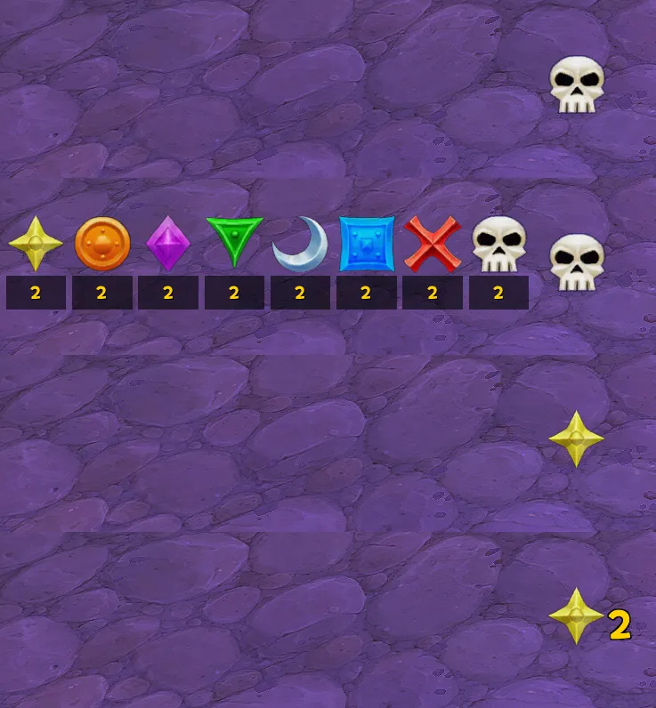

내 차단이 별이었나? 역삼이었나? 동글 2였나? 

처음 접속하면 해골 징표가 화면 중앙에 표시될 것이고, 드래그로 옮기면 위치가 저장됩니다.  
기본 해골 징표를 클릭하면 왼쪽으로 펼쳐지고 표시할 징표를 클릭하면 해당 징표가 표시됩니다.  

아주 간단한 애드온이므로 디자인을 바꾸거나 기능을 수정, 추가하고 싶으면 코드를 AI 에게 물어보시면 됩니다.  
애드온 수정 후 와우 재접할 필요 없이 /reloadui 혹은 /rl 하시면 바로 적용됩니다.  

[애드온 다운 (구글 드라이브)](https://drive.google.com/file/d/1HlM4FjvkhC87bIwmP5ZmkN6VGR6dYkeT/view?usp=drive_link)