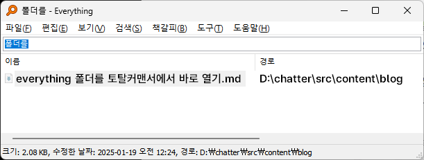
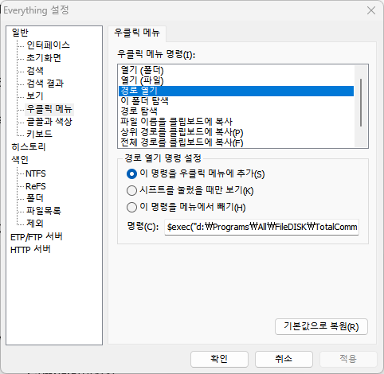
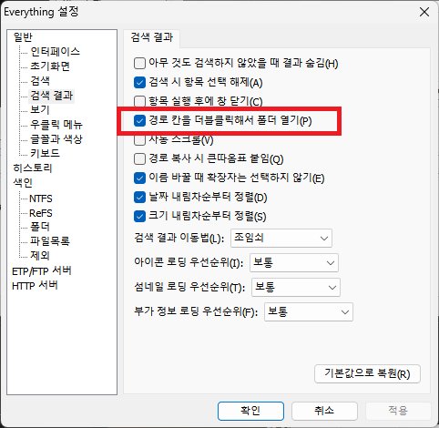

아래와 같은 파일을 검색했습니다.  

  

Everything 검색 결과에서  
파일을 더블클릭(or Enter)하면 실행되고 (기본 설정)  
경로를 클릭하거나 파일을 Ctrl + Enter 해도 아무 반응이 없지만 (기본 설정)  
일반-검색 결과-'경로 칸을 더블클릭해서 폴더 열기'를 체크할 경우, 경로를 더블클릭(or 파일을 Ctrl + Enter)하면 탐색기로 해당 파일이 들어있는 폴더를 보여주는데  
아래처럼 설정할 경우 경로를 더블클릭(or 파일을 Ctrl + Enter)하면 탐색기가 아닌 토탈커맨더의 설정된 패널에 파일을 보여주고, 포커스합니다.  
굳이 번거롭게 마우스 우클릭 메뉴를 띄울 필요 없습니다.  

 | 
--- | --- |

입력할 명령은 아래와 같습니다.  
   ```
    $exec("d:\Programs\All\FileDISK\TotalCommander\totalcmd64.exe" /O /A /R="%1" /P=R)
   ```

`/O` : 토탈커맨더가 실행중이면 해당 토탈커맨더를 사용  
`/A` : 토탈커맨더가 실행중이 아니면 토탈커맨더를 실행  
`/R=` : 오른쪽 패널에 표시  
`/P=R` : 오른쪽 패널에 포커스  


[토탈커맨더 parameters 위키](https://www.ghisler.ch/wiki/index.php/Command_line_parameters)에서는 /O 옵션과 /P= 옵션을 같이 사용할 수 없다고 되어 있으나, 옛 문서인지 몰라도 정상적으로 작동합니다.  