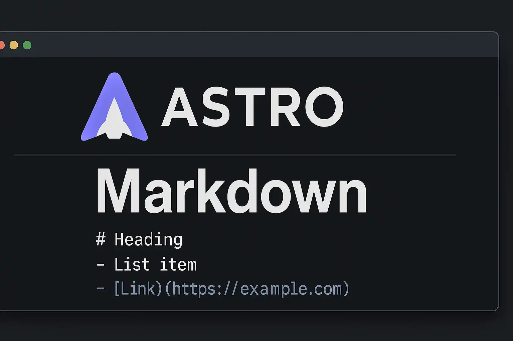

이 블로그에서 markdown 문법이 어떻게 표현되는지 확인할 수 있습니다.

## Headings

# H1

## H2

### H3

#### H4

##### H5

###### H6

## Paragraph

실낱같은 햇빛이 땅위의 황금을 비춰 번쩍번쩍 빛났다.
백리장청은 득의한 미소를 지으며 표사들이 황금을 상자에 담는 것을 바라보았다.
그중 한 표사가 고개를 들어 백리장청에게 물었다.  

"누가 우리를 구해준 것이죠?"<br>
"그 외에 누가 있겠느냐?"<br>
"그라뇨? 그가 누굽니까?"<br>
"그는 바로 나요."  

모든 표사들이 어리둥절해졌다. 왜냐하면 이 말을 한 사람이 세 명이었기 때문이다.

한 명은 노인이었고 한 명은 노파였으며 한 명은 육소봉이었다.  
노인이 변장을 제거하니 그는 원래 육소봉이었다.  
노파는 원래 노실화상이었다.  
육소봉은 원래 사공적성이었다.  
그들은 또다시 맞바꾸어 변장을 했던 것이다.  
모든 표사들이 웃음을 터뜨렸다.  
우육탕은 한층 더 깔깔대며 웃었다.  
그중에서 가장 큰 소리로 웃은 사람은 뜻밖에도 육소봉이었다.  
그는 한 사람의 웃음소리를 들었기 때문이었다. 그 사람은 지금까지 웃은 적이 없었다.  

## Images

#### Syntax

```

```

#### Output



## Blockquotes

The blockquote element represents content that is quoted from another source, optionally with a citation which must be within a `footer` or `cite` element, and optionally with in-line changes such as annotations and abbreviations.

### Blockquote without attribution

#### Syntax

```markdown
> Tiam, ad mint andaepu dandae nostion secatur sequo quae.  
> **Note** that you can use _Markdown syntax_ within a blockquote.
```

#### Output

> Tiam, ad mint andaepu dandae nostion secatur sequo quae.  
> **Note** that you can use _Markdown syntax_ within a blockquote.

### Blockquote with attribution

#### Syntax

```markdown
> Don't communicate by sharing memory, share memory by communicating.<br>
> — <cite>Rob Pike[^1]</cite>
```

#### Output

> Don't communicate by sharing memory, share memory by communicating.<br>
> — <cite>Rob Pike[^1]</cite>

[^1]: The above quote is excerpted from Rob Pike's [talk](https://www.youtube.com/watch?v=PAAkCSZUG1c) during Gopherfest, November 18, 2015.

## Tables

#### Syntax

```markdown
| Italics   | Bold     | Code   |
| --------- | -------- | ------ |
| _italics_ | **bold** | `code` |
```

#### Output

| Italics   | Bold     | Code   |
| --------- | -------- | ------ |
| _italics_ | **bold** | `code` |

## Code Blocks

#### Syntax

we can use 3 backticks ``` in new line and write snippet and close with 3 backticks on new line and to highlight language specific syntac, write one word of language name after first 3 backticks, for eg. html, javascript, css, markdown, typescript, txt, bash

````markdown
```html
<!doctype html>
<html lang="en">
  <head>
    <meta charset="utf-8" />
    <title>HTML5 문서 예제</title>
  </head>
  <body>
    <p>Test</p>
  </body>
</html>
```
````

Output

```html
<!doctype html>
<html lang="en">
  <head>
    <meta charset="utf-8" />
    <title>HTML5 문서 예제</title>
  </head>
  <body>
    <p>Test</p>
  </body>
</html>
```

## List Types

### Ordered List

#### Syntax

```markdown
1. First item
2. Second item
3. Third item
```

#### Output

1. First item
2. Second item
3. Third item

### Unordered List

#### Syntax

```markdown
- List item
- Another item
- And another item
```

#### Output

- List item
- Another item
- And another item

### Nested list

#### Syntax

```markdown
- Fruit
  - Apple
  - Orange
  - Banana
- Dairy
  - Milk
  - Cheese
```

#### Output

- Fruit
  - Apple
  - Orange
  - Banana
- Dairy
  - Milk
  - Cheese

## Other Elements — abbr, sub, sup, kbd, mark

#### Syntax

```markdown
<abbr title="Graphics Interchange Format">GIF</abbr> is a bitmap image format.

H<sub>2</sub>O

X<sup>n</sup> + Y<sup>n</sup> = Z<sup>n</sup>

Press <kbd>CTRL</kbd>+<kbd>ALT</kbd>+<kbd>Delete</kbd> to end the session.

Most <mark>salamanders</mark> are nocturnal, and hunt for insects, worms, and other small creatures.
```

#### Output

<abbr title="Graphics Interchange Format">GIF</abbr> is a bitmap image format.

H<sub>2</sub>O

X<sup>n</sup> + Y<sup>n</sup> = Z<sup>n</sup>

Press <kbd>CTRL</kbd>+<kbd>ALT</kbd>+<kbd>Delete</kbd> to end the session.

Most <mark>salamanders</mark> are nocturnal, and hunt for insects, worms, and other small creatures.