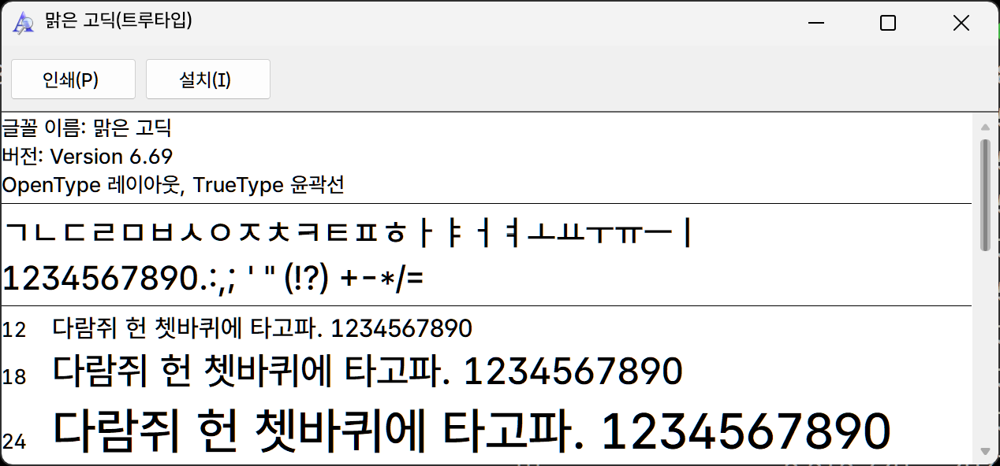

### 프로그램 소개
ttfname3 이라는 프로그램은 아래와 같이 폰트의 상단 헤더 정보를 추출하거나, 추출한 정보를 이용해 다른 폰트를 편집할 수 있는 프로그램입니다.

- 한글 윈도우 기본 폰트인 맑은 고딕(malgun.ttf)의 정보입니다.  
  

- 맑은 고딕의 폰트 정보를 추출해서 수정한 Pretendard GOV Medium(malgun.ttf) 입니다.  
글꼴 이름과 버전이 맑은 고딕과 동일합니다.  
  


<a href="https://drive.google.com/file/d/1JfmSgaNcK2c3Mn0maAmuAnM-9nKO3m1k/view?usp=drive_link" target="_blank" rel="noopener noreferrer"><mark>ttfname3.exe</mark></a>  

"요즘같이 무서운 세상에 .exe 파일을 함부로 받을 수 있나" 하시는 분은 일본 사이트에서 직접 받으셔도 됩니다만  https 설정도 안한 일본 사이트가 훨씬 위험하지 않나 싶습니다.  

   <a href="http://web1.nazca.co.jp/nzkchicagob/m6x9801/mrktb1bs5.html" target="_blank" rel="noopener noreferrer">
http://web1.nazca.co.jp/nzkchicagob/m6x9801/mrktb1bs5.html</a>  


### 사용방법

ttfname3.exe \<input font file> -o \<output xml file>  
ttfname3.exe \<input font file> \<input xml file> -o \<output font file>

ttfname3.txt 파일에서 안내하는 사용법은 위와 같은데, 예를 들어 나눔바른고딕을 맑은 고딕인 것처럼 수정해보겠습니다.  
> 파일 이름은 상관없으므로 NanumBarunGothic.ttf -> nbg.ttf 같이 짧게 바꾼 상태에서 작업 후 다시 NanumBarunGothic.ttf 으로 수정해도 됩니다.

ttfname3 과 폰트 2가지를 같은 폴더에 넣고 명령 프롬프트(cmd) 창을 엽니다.  

1. 맑은 고딕의 정보 추출하기 (malgun.xml 생성)
    ```
    ttfname3 malgun.ttf -o malgun.xml
    ```

2. 추출한 malgun.xml 의 정보를 나눔바른고딕에 넣기
    ```
    ttfname3 NanumBarunGothic.ttf malgun.xml -o NanumBarunGothic.ttf
    ```


### 그래서 이걸 어디에 쓸건데?

윈도우 폰트 폴더에서 malgun.ttf 를 제거하고 수정한 malgun.ttf 를 넣어주면 맑은 고딕을 내가 좋아하는 폰트로 변경할 수 있습니다.  

아래 글을 참고합니다.  

<a href="/windows-default-font-change" target="_blank" rel="noopener noreferrer">
윈도우 기본 폰트 변경하기</a>  