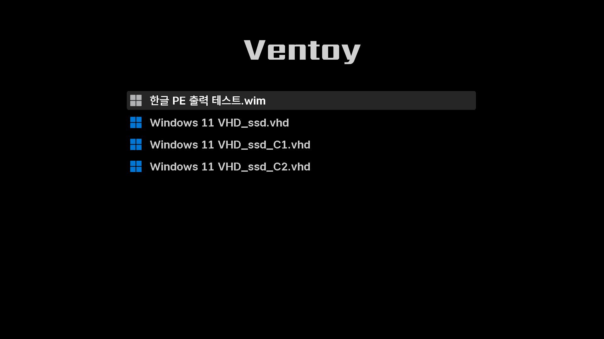
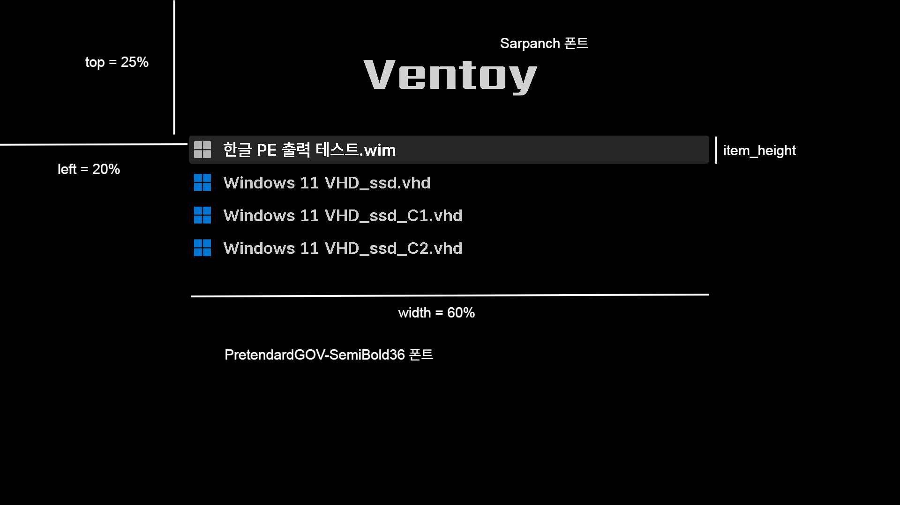

어짜피 몇 가지 리스트 중에서 하나를 선택하고 엔터 누를텐데 다른 정보는 필요없을 것 같습니다.  



<details>
<summary>theme.txt</summary>

```
# Main options
title-text: ""
desktop-image: "background.png"
desktop-color: "#000000"
terminal-font: "acinema16"
terminal-box: "terminal_box_*.png"
terminal-left: "0"
terminal-top: "0"
terminal-width: "100%"
terminal-height: "100%"
terminal-border: "0"

# Boot menu
+ boot_menu {
  left = 20%
  top = 25%
  width = 60%
  height = 90%
  item_font = "PretendardGOV-SemiBold36"
  item_color = "#cccccc"
  selected_item_color = "#ffffff"
  icon_width = 48
  icon_height = 48
  item_icon_space = 20
  item_height = 60
  item_padding = 20
  item_spacing = 10
  selected_item_pixmap_style = "select_*.png"
}
```
</details>

<details>
<summary>ventoy.json</summary>

```
{
    "control":[
        { "VTOY_SECONDARY_BOOT_MENU": "0" },
        { "VTOY_MENU_LANGUAGE": "ko_KR" },
        { "VTOY_DEFAULT_SEARCH_ROOT": "/menu" }
    ],
    "theme":{
        "file": "/ventoy/themes/Distro/theme.txt",
        "default_file": 0,
        "resolution_fit": 1,
        "gfxmode": "max",
        "ventoy_color": "#000000",
        "fonts":[
            "/ventoy/fonts/PretendardGOV-SemiBold36.pf2",
            "/ventoy/fonts/PretendardGOV-Bold36.pf2"
        ]
    },
    "menu_class":[
        {
            "key": "VHD",
            "class": "windows11"
        },
        {
            "key": "PE",
            "class": "windows-pe"
        }
    ]
}
```
</details>

#### **배치**
일단 배경화면(background.png)을 하나 만들거나 준비합니다.  

저는 검은 바탕(#000000)에 Sarpanch 폰트로 위쪽에 간단하게 Ventoy 글자만 넣었습니다.  




그 다음 리스트가 출력될 공간을 생각합니다.  
어짜피 한 번에 만족스러운 결과가 나오기는 어려우므로 left, top, width 같은 수치는 일단 그대로 따라하고 나중에 수정합니다.  
해상도가 달라져도 가로를 대칭으로 유지하려면, `left = (100 - width) / 2` 로 해야겠지요.  
기본적으로 표시되는 ventoy 버전과 사이트 글자 표시를 숨기려면 아래처럼 글자색을 배경색과 일치하도록 수정합니다.  
혹시 ventoy.json 파일에 "ventoy_color": 항목이 없으면 추가합니다.  
넣는 위치에 따라 , 주의합니다.  마지막 줄에 넣으려면 ,를 제거해야 합니다.  
```
"ventoy_color": "#000000",
```


#### **아이콘**
ventoy.json 파일에서 menu_class 부분을 참고합니다.  
파일명에 `Key`에서 설정한 글자가 있으면 `class`에 설정한 아이콘이 표시됩니다.  
`대소문자를 구분`합니다.  
- Windows 11 VHD_ssd.vhd 파일에는 `VHD` 글자가 있으므로 `windows11`.png 아이콘이 표시됩니다.  
- 한글 PE 출력 테스트.wim 파일에는 `PE` 글자가 있으므로 `windows-pe`.png 아이콘이 표시됩니다.  

아래 다시 소개할 [www.gnome-look.org](https://www.gnome-look.org/browse?cat=109&ord=rating) 에서 테마를 살펴보고 마음에 드는 아이콘이 있는 테마를 다운받아 사용하세요.

#### **해상도**
UHD, FHD 모니터 2대로 테스트한 결과 `"gfxmode": "max"` 옵션일 때 자동으로 최대 해상도로 표시됩니다.  
("gfxmode": "auto" 일 경우 4K 모니터에서도 1920x1080 으로 출력되는 것 같습니다.)  
모니터 해상도가 다른 컴에서 사용하면 보기에 만족스럽지 않을 수 있는데, 해상도에 맞춰 세세하게 따로 설정한 후 해상도에 따라 자동으로 선택되도록 설정할 수도 있습니다.  
ventoy 사이트의  [About resolution_fit (1.0.86+)](https://www.ventoy.net/en/plugin_theme.html) 부분을 참고합니다.

> 나는 ventoy 제대로 설치한 것 같은데! 모르겠다... PE가 이상한가? 남들은 잘 쓰는 것 같던데... 해상도가 800x600 으로만 나온다면
https://nonlol.tistory.com/223 에서 수정된 ventoy_wimboot.img 파일을 받아서 교체합니다.  

#### **폰트** 
최근 벤토이는 자체적으로 한글 출력을 지원하지만, 좋아하는 한글폰트가 있다면 ttf --> pf2 파일로 직접 변환해서 사용할 수 있습니다.  
[grub-mkfont 윈도우용](https://m.blog.naver.com/a1jyh/221395655744)을 다운받은 뒤 사용법.txt 를 참고합니다.  
나눔고딕.ttf 파일을 36 크기의 나눔고딕.pf2 파일로 변환하는 예시입니다.  
pf2 파일명에 폰트크기를 적어두어야 테스트할 때 편합니다.  
```
d:\downloads>grub-mkfont.exe -s 36 -o 나눔고딕36.pf2 나눔고딕.ttf
```
부팅 리스트가 아주 많거나 최대한 많이 보고 싶을 경우  
폰트 크기를 줄이거나 item_height, item_padding 수치를 적절히 조정하거나, top 수치를 줄여서 전체 공간을 위로 올립니다.  
위의 설정 그대로 적용하면 첫 화면에 10개의 리스트가 보이고, 스크롤로 아래쪽을 볼 수 있습니다.  

#### **다른 테마**
theme.txt 파일과 ventoy.json 파일의 내용을 대략 이해했다면, 이제 다른 테마로 변경하는 것은 쉽습니다.  
Ventoy는 Grub 부트로더를 사용하므로 Grub 테마를 바로 사용할 수 있습니다.  
[www.gnome-look.org](https://www.gnome-look.org/browse?cat=109&ord=rating) 테마 페이지에서 원하는 테마를 다운받고, theme.txt 파일과 ventoy.json 파일을 적절하게 수정하면 됩니다.  
간단하게 예를 들면, 다운받은 테마의 폴더 이름이 Distro 일 경우  
ventoy.json 파일에서 아래 부분만 수정하면 기본적으로 바로 적용되고, 이후 세세하게 폰트와 theme.txt 파일을 수정합니다.  
```
"file": "/ventoy/themes/Distro/theme.txt",
```


이후부터는 지겹도록 `수정 & 확인을 반복`합니다.

아무리 봐도 제대로 설정한 것 같은데 결과가 이상하면, 정말 실수를 하지 않았다는 가정 하에 특정 텍스트 에디터 문제일 수 있으니
벤토이 설치 폴더의 VentoyPlugson.exe 을 이용해 현재 상태를 살펴보거나 수정하는 것도 좋은 방법입니다.  

> theme.txt 파일과 ventoy.json 파일을 수정할 때 `많이 하는 실수는 폴더 위치, 확장자, 그리고 특히 , 쉼표` 입니다.  