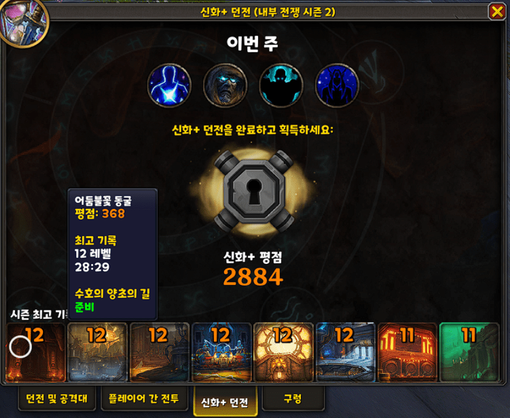

와우 기본 디자인과 결합된 스타일이라 마음에 듭니다.  
각각의 던전을 클릭할 경우 해당 던전으로 이동합니다.  

원본 : https://wago.io/sRm-EdTUW

위 사이트를 참고하시고, 얼라/호드의 던전 입구가 다른 경우가 있는데, 혹시 원 제작자가 아직 제대로 수정하지 않아서 얼라/호드 중 하나가 안될 경우 아래 제가 수정한 코드를 사용하세요.  
예를 들어 왕노다지 광산!! 같은 경우 아래처럼 수정해야 얼라/호드 모두 제대로 작동합니다.  
[247] = {467555,  467553}, -- The MOTHERLODE!!!

<mark>코드를 마우스 좌클릭 3번!</mark>

weakaura

!WA:2!1Qt3UTXX6fBxGdkbkGJBAW5CAa6gI2yPwAg(VifoUa8pjZeksvsQOeyyqnC3HCNOLZUz2DLevGlWXxCA6T(rq9Qcu0l0JGFcemk6dGVOpa5jOFZm7VdPLv6PhHG4H7(9))ZSZ927rlFKXJm(P8xr0TPJT9z64p7JMDoAHDVoVE5zwp5hgvCVlyxmC(CxS39Ugz89(UEyJdqxC)4FqO3NTkceQUPn7qBc1Bw7UdM0D0B1TTTmSpNo(CId(Ks(mlN)Atpph3D)YVKZR8e7VmIzFzXwCH5Kx5XilwGzUd(cwWY)7wERCWT8PepNh57INIM5AZM9mmY6aBd8jVZ1Fg(mm1BS)85KlUEA7MJNmD8KMJM8UyWfGosa3vTTPgepIn19vCa4uoMkhYWavgn(WU97)kxhSLvpd3mJOOLy3m38XZCSqRWSR1bJG9YPCrBMRhYZ3vYmRZrRC9y(4tUYapdKOjaeSN1T)H7Du)x7tduQmxBqC)EFQUh5mCjeDLZhJeRNiFpxC)p(OFgmNygfz9nGfbK3)935WSxWWUUsV2F)N9r3)1UyR5cd)n)5alDbrHH8WMSZK48GRanBeEbxD39tV5HVf(5mK(Ply2(uJF6tCEKh(cVPUMiWz9Tb(tNFJ4HI)3CB2seaqWIwuBk(1rVo7FNRZdtqH22w2SV6E37Ep4DYNgkDTAE0KHo)LIhI8bBhYJOFmXWZSvt4N)SKxKlWgIh(7FRmK67cKO3iEpp0JmFfOPmBWOJNapS1GHd6EZdzGEXH5kbG6cX4bWFVoqjOEopCpg5sT)jFKbyHqAtMKs3d50Bfp7CBMXXmKZRooyXBJOJWJo8Oj97nO7BKs5uhUk68X9gmO7OPTgozYWdg1B)NnjgRXKlX)MaL6BtPuNrCjZSWN8)82fw2NVhd)d(yQ(Qd)ZkKVuvPIXFXBG4R9TcSWMVI)iUK82z(EE20HG7gImfKyIjr)ukeL8GR5)muXE9IqSfgM3W)zhEWcpkrazOCDf)h9X0fEM)vT4Rnf4owhzHFGyzFcq)pwaxlWaHzMZmXKfME)(ww2iJ)WR5jduiHIzos3c56(PJw6B5rYiEHf8cRtM5bKJ69P38ImJep53MTEH3jwn1gmXipB2Vn7tFAliluNdvlxWgYx48qGkndkejQlzcj58mIzKLo2qLdEYeeWxBeKBY8(IzY017)Ad7PYLMTiqA)xCd5I)2)TN8eTdWuJNShZ21Bjqhkotg4H9jZyi2QmzSSbnxRFVwJAo67MoO5bD1EQwwoop2vRJpDb2MQnbBH58wRLWH4MncpjzauMU)ZtsKxKjdzUg12lceptmnJg8xmoTzyiqFpgu)zRSI)jBUuIY2cesIv(dqo9mMypww9cic4uxIHegeeNT1pkGn8pqpBdVq3AL7YuV45vlSZlaC)XkvQwPuLxMJd6(mYsTwGNXknSvkxxcBXcfQxqc7etS23age8fAhsOuGfyfKQwtIuPkfRukejguFrZEo3wOnHav0sHKQSFaX1ZLd(HiQbIrqk6GufkwUyPsvdubWCgs)XyppcDH2yFAA8QvigVaj7a7f(pgkvqbwzH0v0LDIzu5IseG0fMf2t7zillxfORht(gPH(aBkccRHWU0yulM(LcXWesMxcLuuKLQXuVqTay5L4EcyJEF0VAJyjQEaoe8cHLAaX)sKneGV0r1fwnwSkeyFhdPTlHumFitGHpFnov6fArOeevjPCOt5RqgCpdZbkoCR((Jblgu8r4(7WqyQnlnRkwRIu8Q2OEJDK8QPVUjHAyR6XlwRCmSbQculZ2yjY3sBSfAbeRrvIgbSQfIvJcfIZryiILwhOEGNk8nI5sGVPheXR1Xw)01OD1yyBKWpE(sBaJw(q0UfWnEF81qTymQHUZtxbLs0nvHSEScumoXTlu6EgO(lvbFNyWdIdpYbkwd2kyOcgOfAJDim8T646lghrHYnAevmOA5q7pqtTr22NQ9myysL4OYshMeuOgMjg6RBXdg6kNAccCHoskyvuMzxUr5DQf4aAdL8944ngAwOAjBupsSQfiwDqStnXqFfnrNwSQpUXojeSUReb2nVekDWuQovQqcHjixquTGJX3GSuJNlvOEckFa6CHqB7RwEbs7JQgVtG7Fa2YdKaWUd9S6JiQKUKuOlVt5s1cCSJWWSKunpBTVge9lHsF7Q13gYOvDevUtOkIturTrcfAm0PlQYpJ4V8mcFuwvDljk8q1MmDyOBvOs6d(gifoIYqvddm927QaD48GcsWeVGJddZAQK1uQsLOOI6HfwGXzECh0LivDSs1yNrqggmKh2C9i6kjvTVgAmbUQryxL4RYb1q427DcIAgkMxcCU7cJYOBcBVIQ9eTVYNE6kqDvWFNc3r8HzFp1102rrmRwkPtZKrIBylk(RWUQLJgJOy9CAvQvPu1AkTyGHirw(QHXvlK0vh1Ka6ABcGtCvHVsWal12PA1Q500elkhhPCWWjpR7O(d709Z)8pxLxfJ9svIr5ikmCltTmEPk1skz2qTEWKTMJprPJGGKJrR0H9VbT5rQDRuJbLL6TqRvCVCWSgLRwPsTGS7oyTHG9NbwudSk41JbVQsrMMWKQ4LQnAbCQgJtG1iAsRjeO4km9bbyOkAnIrlWUFi050hphyOcS1ledBy3neDHppAc6C6zQQ21lgJqy8dVvJurC1HK616QuUHmwTCTDaNqG7cYrpd7AUlu68XwyKjKLTpA5mIQrOrXBdxpihwAqo2MhKOAkQflTLIJNgG1HOjIoejCQQ1REPyu2jcfOcitoGlHERbmWiqqA7CR1B6vPqPW(mL2jWV00AbKg9yeuHthg4A5kvuQgHsOW0c2w1PyQjeIX7hd79tbNGrO4b8HJB1bDonS4qp6C(MUW7cMBlemSGy)t7TwOrLAvUJ05aFM9LsYmI4QU9IGUGCvOEzLaFGg(RhUuPqLydvTunovlovoyEfoOHLZg5pBfSjS5yTdTTvBkxPqXyA3ir7Rl9zyzlkveke7csgczFQPVHgSxDEe)zRP1LJWkCRlhzzGwk6EJxG0xjsIxD7vFMi7uQDmKLRe3bBmmrf9WUFm0t4T6ZP1M4j4qxy7jQJlxnCWeaZkbJl3MWZEMbBvaA9arIRTZKGGxb3cNylGhWUfbuwJjvIzsX4r2MBbBEwRTfEUQHoC0tocbv7oeMuITkQTgcQABOThNcQmRAS0LOVbpEf0jijNPIqHyMLO3eFk3nO7fdbUuTeXmJ5LTpB9qMQLc2YqjOJt9AR1BFp(gAwKCMkaKFC6uUl4caX5ItKe69V12Am5iC)4l1WuJxUHtzya3C(unKpdnftplpXyDyg67zaSZGFqD8Zmj8WsGbReNTQMb)K4iUAlHU5Wap5H(fyKlwt3edJ(FS8CIfdI57WPKB(SRZfXbDmwCkSCTps5gbbh8ZqPyUOhnK2o4CPHNxk(5dS96dJ0tX8JlPS85VmMtrgMawUBpOaeS9lYL4T2oIibNMt7PnnmgsDZ3ZvSOVnewBSv2wa4W4HgtBBcLHWGLW9OEz3o(uFc)JFOP7YpZw(g17Ypv6TY2StNHdM2FyZoD7KD7uGl9urpcCxzwlT(yiuSj4PCZFmYt3C)2Dsi3jvGyztCytAW8hA8t5ElLxK)iH)yBTNcU1qZt211ftiU2fRd144aPsLCAzL0jBUubFHMz5PF10YkiWj4S1aiaTC7BxL)G0itsu3SBEivA(fFAGCAi2IIPC3INlmbP8pRBgay5ilaDZXbRJtuOWgd2sbXru2DoCjPXkC9TBfUDlyG6Tvpi1A5mKxFB9t5jyBTTm0oSsss(YHxKQKoC4xmc5dKOE6G88(XoAbVqY0CAgXyPrOAuO6uUBL0Ag2RNHknlPSjBLGY5eqPCySppba5xcVQZl2()tEJ0S1bXebOYpyvh3yAkpdA5hjqCsWwZFUe6xWRcN64LLedsfPeRCAH0mBpQmbUPqoKaj2ngpVnMtsESlS7misr8nFCdKR1GjS22E2S2we9tDHaw6QoqqdWC(YJC2mH98ye4NGSYRjXbwOXFiGLaj0Rnb5yDgXbsAGSD(hCtPwKmbtuLAZgDjHIn(504FaqLsuBIBqhNZuR8bb6WMrWtGUuEeND75o8COPuOHugHNeGNbtJllhMMFPC0pnG93HORFzkkjQYu6AbXTB6jA)bT2b1gJVtffIjQO7d)r3Ij59tpzO)HcWMg4BbtHeVD3FD)(2RjkPr(dXkVGpbKixpizJZNwWo(NK8DWUpS3A9C1OfPz7AzrjfZKwMb(lfFyoiE4FuRW6nusclmzch2TYQL9d0hnyQM0k3DI2I6F8Xe3(UbAYPfZbtTPva(VesNLlgeMucsE3GX(Kw7KJcMpXmD3jXnnHP3j5wCpbMUxZE972z6GHtM(1dgE8G)Fq4tmO6FYe(04WWlrqQhDXecFWS)O1a503)jt4h1TzNVtiJftlMBkgojbgBAF(w3XggPd6fZcNsujjQ42Ek3WXY3CopNT4FKnrs0(42ly)lO(YgQsj2W0l38GsscW3AyKyfpTui1vNms8nMZtGrgyEP9RU5Iki((e2u8A7pGpvYjx7nWNqJ0wiWWU(iZ8HXte5olC9gNapEhwasYnk)7aueRwdyEoYTtHaw97I4660i985BOSFaXsR1pV4lUBrl3nJVsqJBqlT2tLb(8UNQrAQ4qCfG81u5UT7L4NVpu0J3CUkNclh((5wQ92hrjEsB4pYBeCFx0(NFk0G89(Q4XxwOBeEhzGSyiPyokPlwY6uvobENsu4mzmgg33WDInhGT0XeRTI4R4gQiq8FydcZt04EmowBVTG)WiSQXbPVqhHNLtcNA63Be9YoPFtygHC0hPhNZr(izjDLbpluy3wOI3w3xaH1mj3wdpETNn2njT8sLhaLBuTz3O2hCsmPB)UhoC0KPtgoTZrd2V7Wb5uo3K0UT0naJpIS1tRcZMsV3b(oVtnnpxjYPLpF(G6)HNMG4jIuBov5x1O4D4NjZMoIPB((tMXp0BxZ1U8teQ5vmXhuNFDWU5V4vH(ft(DmKFDf5718xF)h15NpfJDAYVnvEJ4rxMZGxmNSitRlTTxE4dkKV8plVGAI9dYj3SXTh1T7Grilht09C(KqAZNqRdXLxb2WCMlE5zy2OI5lKVWvE26bx9WF99(p)KSedN)MpWnLsCTodD(hyBach(KRNZLHXE8RQ3dgDEWDc03dKUHoIl3vMs(eJR7S)p4UZfl1hVABgHY5m2CuIR)hIswksLQDJ5E38WBk8g(5lY)6n8R32V6THzAIRYjGSir9vCyeMZcT4XeceV5p8RU5F5MF6M)vy5s1NCLE0LknZ1eQ8Usc)6tVgwQJf(DxZ3eA)6ASaB(i3zvZxSr(6p6S)RV9)n

