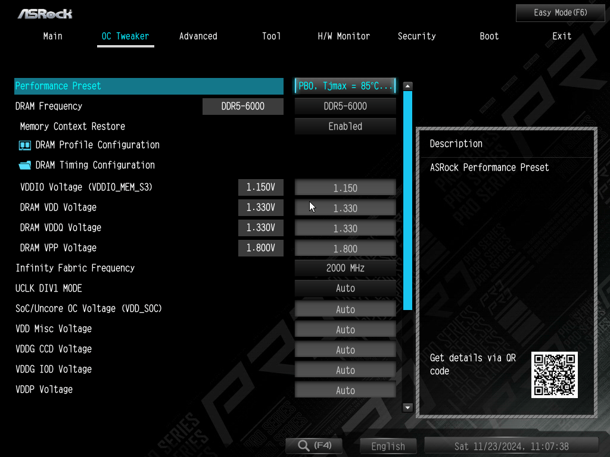
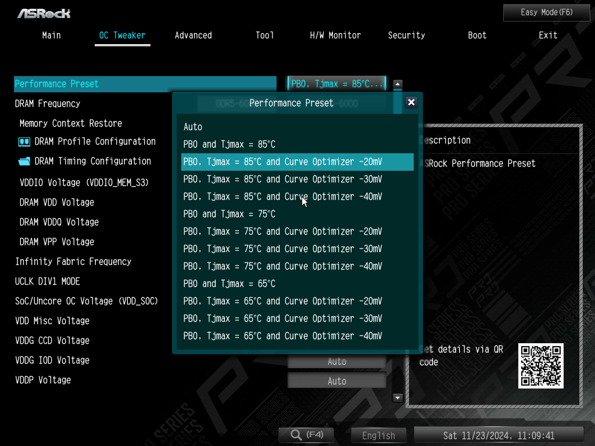
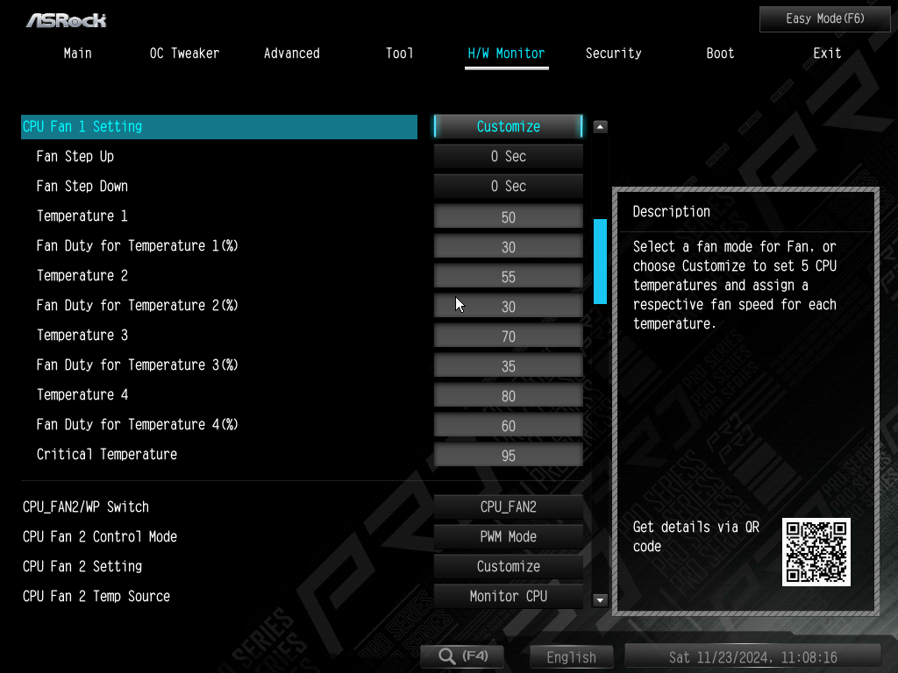
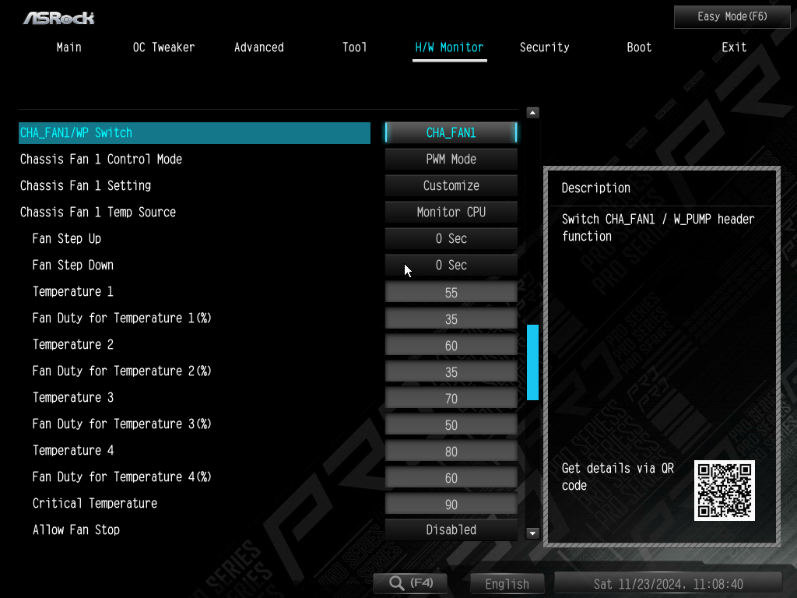
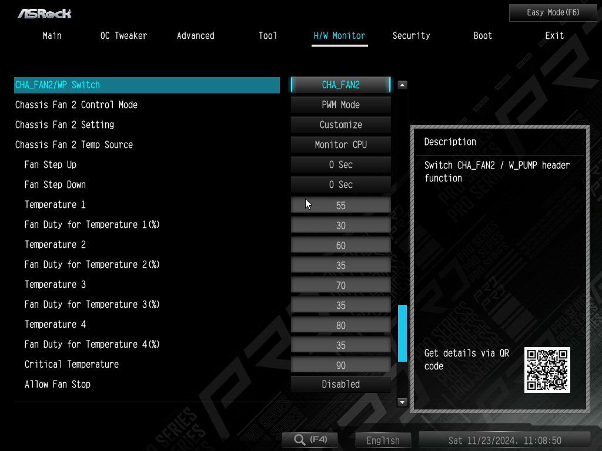

ASROCK 보드와 [파워트레인 P60](https://chatter.kr/mcube-vs-p60/) 케이스를 기준으로 설정한 화면입니다.  
다른 브랜드도 설정화면과 팬과 커넥터의 위치만 조금씩 다를 뿐 기본 개념은 같습니다.  
방온도가 다르고, 케이스가 다르고 팬이 다르기 때문에, 팬속도 설정에는 정답이 없지만, 가능한 조용하게 사용하는 것이 목적인 설정입니다. 

  
  

일단 본인의 케이스에 맞게 설치할 팬의 개수를 정한 뒤 보드의 CPU 1, CPU 2, CHA 1, CHA 2 등 어디에 연결할 지 결정합니다.  
CPU 팬은 CPU 1에 연결하고, 다른 팬은 커넥터 길이에 맞게, 선정리 고려해서 연결하면 됩니다.  
이 케이스에는 케이스팬을 4개 설치할 수 있지만 저는 하단팬을 제외한 3개 설치했고 아래는 각각 연결한 커넥터입니다.

`CPU 팬을 CPU 1` 커넥터에 연결  
상단 케이스팬을 CPU 2 커넥터에 연결  
전면 케이스팬을 CHA 2 커넥터에 연결  
후면 케이스팬을 CHA 1 커넥터에 연결  

  

잘 살펴보면 알 수 있겠지만, CPU팬을 포함해서 온도 70도까지는 팬속도를 대략 30% 정도로 일정하게 설정했습니다.  
전면팬(CHA 2)은 중요하지 않기 때문에 아주 조용하게 설정하면 됩니다.  

팬속도를 설정할 때  
Temperature 1 에 20을 입력하고 Fan Duty for Temperature 1(%) 에 팬속도를 입력하면, 미리 팬소리를 들어볼 수 있습니다.  
모든 팬마다 온도에 따른 팬소리를 미리 들어보고 본인이 감당할 수 있는 정도로 설정하면 됩니다.  
실사용하면서 HWINFO 로 온도를 모니터링을 하고, 팬소리를 들어보고 팬속도를 조금씩 수정하면 되겠습니다.  

며칠간 누적된 온도와 팬속도입니다. 

CPU는 온도 좀 높다고 무슨 문제가 생기는 부품이 아니라고 봐도 됩니다.  
CPU 온도 좀 올라가는 것이 걱정돼서 상전 모시듯이 시끄러운 소리 참아가며 쓰지 마시고, 약 70~75도 이하일 때는 조용하게 설정하길 추천합니다.