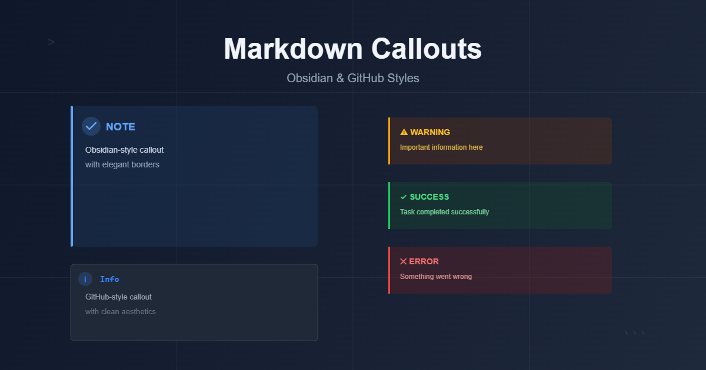

obsidian이 인기를 끌고 github를 구경하다보니 callouts에 대해서 알게 되었습니다.  
심심한 마크다운 파일에 살짝 재미를 더해줍니다.  
옵시디언으로 작성한 .md 파일을 Astro, Gatsby, 11ty, Hugo, docusaurus 등 SSG 생성기를 이용해 블로그에 게시하면 기본적으로 모든 callouts이 마크다운 기본 blockquote로 보입니다.  

> [warning]  
> 정식 마크다운 문법이 아님

그래서 요즘 remark-callouts 같은 것들로 사이트에 callouts을 구현하는 사람들이 많아지는 것 같습니다.  

이미 좋은 것들이 많이 공개되어 있습니다.  
<mark>[rehype-callouts](https://github.com/lin-stephanie/rehype-callouts)</mark>  
제 눈에는 이게 제일 좋아보이는데, 바로 갖다 쓰면 재미가 없잖아요.  

물론 저는 개발자가 아니니까 CSS 제외하면 AI가 99% 작성할텐데, AI 한테 계속 물어보니까 "5분만 투자해서 이미 잘 만들어진 것을 갖다 쓰시는 것이 정신건강(?)에 좋습니다"라고 권유하더라구요.  
그러거나 말거나 여러 AI를 압박해서 스스로(?) 만들어봅니다.  

## 첫 고민 : 어떤 작성 방법을 선택할 것인가

일단 가장 중요하게 생각한 것은 callouts 기능을 사용해서 작성한 글을 일반적인 마크다운 뷰어/에디터 혹은 마크다운 기반 노트에서 볼 경우 이질감이 적어야 합니다.  

작성 방법은 크게 2가지로 나뉘는 것 같습니다.  
```
:::note  
이 방식은 callouts을 포함해서 여러 다양한 기능을 원할 때 택하는 방식입니다.  
예를 들어 :::video 로 유튜브 링크를 삽입합니다.  
:::
```

```
> [!NOTE]  
> obsidian과 github에서 사용하는 방식입니다.  
```

다른 기능은 필요없고 callouts만 필요하다면 둘 중에서는 당연히 <mark>아래쪽의 방식으로 작성</mark>해야 합니다.  
obsidian의 유행이 끝나더라도 마크다운 파일 형식은 아주 오래 사용될 것이 분명하므로, 최대한 오리지널 마크다운 문법에 맞게 작성해야 하고, 그러면 적어도 blockquote 형태로 보여주고 읽을 때도 조금 더 자연스럽습니다.  

```
> [!Warning]  
> callouts 형식으로 작성  

:::note  
일반 마크다운 뷰어로 볼 때  
:::  

> [Warning]  
> 정식 마크다운 문법이 아니고 callouts 형식도 아니지만 자연스럽게 읽힘  
```

> [!Warning]  
> callouts 형식으로 작성

:::note  
일반 마크다운 뷰어로 볼 때   
:::

> [Warning]  
> 정식 마크다운 문법이 아니고 callouts 형식도 아니지만 자연스럽게 읽힘  


## 시작 : 자꾸 이것저것 설치하기 좀 그런데...

AI에게 시켜보니까 unist-util-visit 이건 꼭 설치해야 한답니다.  

> [!TIP|hide]  
> unist-util-visit 가 뭔가요?  

#### 역할과 핵심 기능
- 트리 워킹(트리 순회): 루트부터 자식 노드까지 재귀적으로 방문하며, 특정 타입이나 조건에 맞는 노드만 골라 처리할 수 있습니다.
- 유연한 필터링: 노드 타입 문자열, 배열, 혹은 사용자 정의 테스트 함수를 인자로 받아 방문 대상을 정할 수 있습니다.
- 제어 흐름: 방문 중 CONTINUE, SKIP, EXIT 같은 반환값으로 순회 흐름을 제어할 수 있어 복잡한 변환에 유용합니다.

#### 언제 사용하나
- 마크다운/HTML AST 변환, 플러그인 개발, 코드 분석/리팩터링 등 AST를 다루는 모든 상황에서 사용합니다. remark, rehype 같은 생태계 플러그인에서 표준적으로 쓰입니다.

안그래도 블로그가 자꾸 무거워지는 느낌인데 또?  
엇? 블로그에 **검색 기능**을 추가할 때 설치했었네요.  

## 끝이 없는 수정

여러분도 AI에게 코딩 한 번 시켜보십시오.  
요즘 AI 성능이 아무리 좋아졌다지만 자바스크립트 200줄도 안되는 callouts 이 정도의 기능도 아직 한 번에 뚝딱 만들지 못합니다.  
계속 시키면 되잖아? 하겠지만 무료 사용자는 여러 AI를 번갈아 가면서 써야 합니다.  
그러면 A가 만들다가 무료 한도 초과해서 B한테 물어보고 수정하면 또 잘 되던 것들이 안되고, C한테 다시 물어보고... 반복입니다.  
이 과정에서 중요한 것은 코드를 중간중간 따로 저장해서 보관해야 한다는 것입니다.  

코드의 완성도가 8 -> 6 -> 7 -> 9 -> 7 -> 5 이런식으로 흘러가기도 하는데 따로 저장을 하지 않을 경우 9의 코드로 되돌리기가 어렵습니다.  
아마 git이 이런 상황을 위해 개발된 것 같은데, 맞나...  

암튼 여러 AI에게 번갈아서 반복적으로 물어보다보면, 좋았던 코드를 다시 찾을 수 없는 상황이 반드시 오기 때문에 테스트 결과가 좋을 때마다 따로 저장을 해두면 좋습니다.  

이것저것 테스트해보고 잘되는 것처럼 느껴져서 이제 끝이다 하는 순간 다시 한 번 꼼꼼하게 체크합니다.  
작성자가 할 수 있는 실수들을 가정해서 여러 상황을 알려달라고 물어보고 다시 테스트를 반복합니다.  

## 마지막은 CSS

이정도면 됐다! 싶으면 이제 CSS가 남았죠.  
색상과 레이아웃을 결정하는 것은 전적으로 나의 선택이지만 좋은 색 고르기 쉽지 않습니다.  
전문가들이 선택한 색을 참고해서 적용하세요.  

색상, 레이아웃같은 디자인 수정은 끝이 없는 것 같습니다.  
얼마 지나면 마음에 들지 않는 부분이 보여서 수정하게 되고, 또또...  

```css
.callout-wrapper {
  display: contents;
}
```

어느 AI와의 마지막 대화에서 위 코드를 추가하면 좋다던데, 잘 모르겠고 그냥 추가했습니다.  

## 결과물 확인  

최대한 많은 테스트를 마친 현재의 상태입니다. 언젠가 또 수정하겠지만...  
완성된 상태에서 기능을 추가하거나 CSS를 수정하는 것은 아무 것도 아닙니다.  

> 기본 blockquote

> blockquote 내부 중첩   
>> [!INFO]  
>> 이게 되네  
>>> 이건?

> [!NOTE]  
> **기본** ~~스타일~~ `스타일` _이탤릭_  

> [!NOTE]  

> [!warning|hide]  
> title 숨김 옵션

> [!DANGER]  
> 1. css 이렇게 설정하면 뭐 대충 옵시디언 스타일 아닙니까?  
> 2. 박스의 색감이 별로라구요?  
> 3. [obsidian 공식 사이트](https://help.obsidian.md/callouts#Supported%20types)의 색조합을 그대로 사용했습니다.  
> 4. 이제 흔하지 않고 튀지 않으면서도 우아하고, 감각있는 전문가의 손길이 닿은 색조합처럼 느껴질 겁니다.  
> 5. 하지만 obsidian 스타일을 사용하면 callout에 눈길이 너무 많이 간다는 느낌입니다.  
>   .md 파일이 아닌 .html 느낌이 강합니다.  
>   그래서 github 스타일을 사용할 것 같습니다.  

> [!INFO]  
> 중첩 _1_  
>  
>> [!NOTE|small]  
>> 중**첩 2** small 옵션 [링크](https://google.com)  
>>  
>>> [!WARNING|hide]  
>>> 중첩 3 **제목 숨김** 옵션, 크기 원래대로  
>>> AI가 어려워한, 중첩되면 일부 속성이 아래로 상속되던 문제  
>>>> [!TIP|small|no-icon|collapsed]  
>>>> **small + no-icon + collapsed** 동시 테스트  
>>>> 중첩 4  
>>>> 중첩 4 여러줄

> [!QUESTION]  
> Who's to say what's for me to say? Who's to say what's for me to be? Who's to say what's for me to do? 'Cause a big nothin' it'll be for me'  
> 문장이 길 때

> [QUESTION]   
> title을 잘 못 적을 경우

> [!SUCCESS|borderless]  
> 왼쪽 막대 숨김

> [!QUOTE]  
> "제목 있는 인용문"  
> 기본 italic

> [!EXAMPLE]  
> code 테스트  
> `code2test`  
>  
> 코드블럭 테스트  
> ```js file="js"  
> import { visit } from 'unist-util-visit';  
> 
> export function Callouts() {
>  return (tree) => {
>    visit(tree, 'blockquote', (node) => {
>      processBlockquoteRecursively(node);
>    });
>  };
> }
> ...
> ```  

> [!TODO]  
> - [x] 페이지네이션 기능  
> - [x] 검색 기능  
> - [x] medium 스타일 image zoom 기능  
> - [x] github 스타일 callouts  
> - [ ] header에 anchor 달기  
> - [ ] 사이드바  

---  

<details>
<summary>코드 확인</summary>

```js file="callouts.js"
import { visit } from 'unist-util-visit';

export function Callouts() {
  return (tree) => {
    visit(tree, 'blockquote', (node) => {
      processBlockquoteRecursively(node);
    });
  };
}

function processBlockquoteRecursively(node) {
  if (!node.children || !Array.isArray(node.children)) return;
  
  for (const child of node.children) {
    if (child.type === 'blockquote') {
      processBlockquoteRecursively(child);
    } else if (child.children) {
      for (const grandchild of child.children) {
        if (grandchild.type === 'blockquote') {
          processBlockquoteRecursively(grandchild);
        }
      }
    }
  }
  
  processCallout(node);
}

function processCallout(node) {
  if (!node.children || !Array.isArray(node.children)) return;

  const firstChild = node.children[0];
  if (!firstChild || firstChild.type !== 'paragraph') return;
  if (!firstChild.children || !Array.isArray(firstChild.children)) return;

  const textNode = firstChild.children[0];
  if (!textNode || textNode.type !== 'text') return;

  const text = textNode.value || '';

  const match = text.match(/^\[!(\w+)(?:\|([\w-]+(?:\|[\w-]+)*))?\]\s*(.*)/);
  if (!match) return;

  const [_, type, options, titleText] = match;
  const normalizedType = type.toLowerCase();
  const optionList = options ? options.split('|') : [];

  const hideTitle = optionList.includes('hide');
  const collapsed = optionList.includes('collapsed');
  const noIcon = optionList.includes('no-icon');
  const small = optionList.includes('small');
  const borderless = optionList.includes('borderless');

  const typeMap = {
    note: 'note',
    tip: 'tip',
    hint: 'tip',
    important: 'important',
    warning: 'warning',
    caution: 'warning',
    danger: 'danger',
    error: 'danger',
    info: 'info',
    success: 'success',
    check: 'success',
    question: 'question',
    todo: 'todo',
    abstract: 'abstract',
    summary: 'abstract',
    tldr: 'abstract',
    bug: 'bug',
    fail: 'fail',
    example: 'example',
    quote: 'quote',
    cite: 'quote'
  };

  const finalType = typeMap[normalizedType] || 'note';

  const iconMap = {
    note: '📝',
    tip: '💡',
    important: '⭐',
    warning: '⚠️',
    danger: '🔥',
    error: '❌',
    info: 'ℹ️',
    success: '✅',
    check: '✓',
    question: '❓',
    todo: '📋',
    abstract: '📄',
    bug: '🐛',
    fail: '🚫',
    example: '🔍',
    quote: '💬',
    cite: '📚'
  };

  const icon = iconMap[finalType] || '📌';

  if (titleText.trim()) {
    textNode.value = titleText;
  } else {
    if (firstChild.children.length > 1) {
      firstChild.children.shift();
      if (firstChild.children[0]?.type === 'break') {
        firstChild.children.shift();
      }
    } else {
      node.children.shift();
    }
  }

  const checkboxId = `callout-${Date.now()}-${Math.random().toString(36).substr(2, 9)}`;

  let titleHtml = '';
  if (!hideTitle) {
    titleHtml = `
      ${collapsed ? `<input type="checkbox" id="${checkboxId}" class="callout-checkbox">` : ''}
      <label for="${checkboxId}" class="callout-title" ${collapsed ? '' : 'style="cursor: default;"'}>
        ${!noIcon ? `<span class="callout-icon" aria-hidden="true">${icon}</span>` : ''}
        <span class="callout-title-text">${escapeHtml(type)}</span>
        ${collapsed ? `<span class="callout-toggle">&#x3009;</span>` : ''}
      </label>
    `;
  }

  const openingDiv = `<div class="callout callout-${finalType} ${small ? 'callout-small' : ''} ${borderless ? 'callout-borderless' : ''} ${collapsed ? 'callout-collapsible' : ''}">
      ${titleHtml}
      <div class="callout-content" ${collapsed ? 'style="display: none;"' : ''}>`;
  
  const closingDiv = `</div></div>`;

  node.children.unshift({
    type: 'html',
    value: openingDiv
  });
  
  node.children.push({
    type: 'html',
    value: closingDiv
  });

  node.data = {
    hName: 'div',
    hProperties: {
      className: 'callout-wrapper'
    }
  };
}

function escapeHtml(text) {
  if (typeof text !== 'string') return text;
  return text
    .replace(/&/g, '&amp;')
    .replace(/</g, '&lt;')
    .replace(/>/g, '&gt;')
    .replace(/"/g, '&quot;')
    .replace(/'/g, '&#039;');
}
```

```css file="callouts.css"
.callout-wrapper {
    display: block;
    margin: 1em 0;
}

.callout-wrapper + .callout-wrapper {
  margin-top: 1.5rem;
}

.callout-wrapper + blockquote,
blockquote + .callout-wrapper {
  margin-top: 1.5rem;
}

.callout-checkbox {
  display: none;
}

:root {
  --base-font-size: 16px;
}

body {
  font-size: var(--base-font-size);
}

.callout {
  border-left: 4px solid;
  border-radius: 0 8px 8px 0;
  overflow: hidden;
  padding-left: 1rem;
}

.callout-small {
  font-size: 0.875em;
}

.callout .callout:not(.callout-small) {
  font-size: var(--base-font-size);
}

.callout-borderless {
  border-left-width: 0;
  border-radius: 8px;
}

.callout-title {
  display: flex;
  align-items: center;
  width: 100%;
  cursor: pointer;
  user-select: none;
  box-sizing: border-box;
  justify-content: flex-start;
  font-size: 1em;
}

.callout-icon {
  display: flex;
  align-items: center;
  justify-content: center;
  font-size: 1em;
  flex-shrink: 0;
}

.callout-title-text {
  font-weight: 600;
  /* font-size: 1em; */
  padding-left: 0.3rem;
  text-transform: uppercase;
  color: var(--callout-title-color, #333);
  flex-grow: 0;
  flex-shrink: 0;
  white-space: nowrap;
}

.callout-toggle {
  display: flex;
  opacity: 0.8;
  flex-shrink: 0;
  font-size: 0.8em;
  margin-left: 1.5em;
}

.callout-container {
  width: 100%;
}

.callout-checkbox:checked ~ .callout-title .callout-toggle {
  transform: rotate(90deg);
}

.callout-content {
  color: var(--callout-text);
  font-size: 1em;
}

.callout-content pre:last-child {
  margin-bottom: 0;
}

.callout-checkbox:checked ~ .callout-content {
  max-height: 5000px;
  opacity: 1;
  transform: translateY(0);
}

.callout-content > *:first-child {
  margin-top: 0;
}

.callout-content > :last-child {
  margin-bottom: 0;
}

.callout-content p {
  margin-bottom: 0;
}

.callout-checkbox:focus ~ .callout-title {
  outline: 2px solid var(--callout-title-color, #3498db);
  outline-offset: 2px;
}

.callout-note {
  border-color: #3498db;
  --callout-title-color: #2980b9;
}

.callout-tip {
  border-color: #2ecc71;
  --callout-title-color: #27ae60;
}

.callout-warning {
  border-color: #f39c12;
  --callout-title-color: #d68910;
}

.callout-important {
  border-color: #e74c3c;
  --callout-title-color: #c0392b;
}

.callout-danger {
  border-color: transparent;
  background-color: rgba(233, 49, 71, 0.1);
  --callout-title-color: #e93147;
}

.dark .callout-danger {
  border-color: transparent;
  background-color: rgba(233, 49, 71, 0.1);
    --callout-title-color: #fb464c;
}


.callout-info {
  border-color: #1abc9c;
  --callout-title-color: #16a085;
}

.callout-success {
  border-color: #2ecc71;
  --callout-title-color: #27ae60;
}

.callout-question {
  border-color: #3498db;
  --callout-title-color: #2980b9;
}

.callout-todo {
  border-color: #95a5a6;
  --callout-title-color: var(--color-text-primary);
}

.callout-abstract {
  border-color: #34495e;
  --callout-title-color: #2c3e50;
}

.callout-bug {
  border-color: #e74c3c;
  --callout-title-color: #c0392b;
}

.callout-example {
  border-color: #9b59b6;
  --callout-title-color: #8e44ad;
}

.callout-quote {
  border-color: #95a5a6;
  --callout-title-color: #7f8c8d;
  font-style: italic;
}

.callout:not(:has(.callout-title)) .callout-content {
  display: block !important;
}

.callout-small:not(:has(.callout-title)) .callout-content {
  padding: 0.75rem;
}

.callout:not(:has(.callout-checkbox)) .callout-content {
  max-height: none;
  opacity: 1;
  transform: none;
}

.callout-collapsible .callout-content {
  max-height: 0;
  opacity: 0;
  overflow: hidden;
  transform: translateY(-10px);
}

.callout-collapsible .callout-checkbox:checked ~ .callout-title .callout-toggle {
  transform: rotate(90deg);
}

.callout-collapsible .callout-checkbox:checked ~ .callout-content {
  max-height: 5000px;
  opacity: 1;
  transform: translateY(0);
  display: block !important;
}

.callout-collapsible .callout-checkbox {
  /* display: none; */
}

.callout-title:not(:has(.callout-toggle)) {
  /* cursor: default !important; */
}
```
</details>

> [!IMPORTANT|hide]  
> 시간이 남아도는 것이 아니라면 <mark>[rehype-callouts](https://github.com/lin-stephanie/rehype-callouts)</mark> 쓰세요.  
> 더 많은 기능이 필요하면 <mark>remark-directive</mark> 같은 것들을 찾아보세요.  