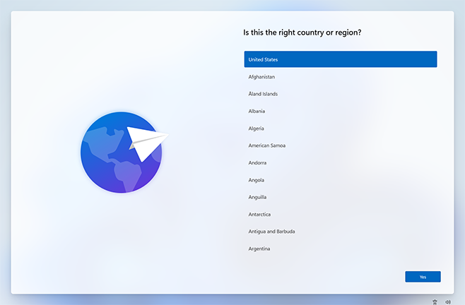
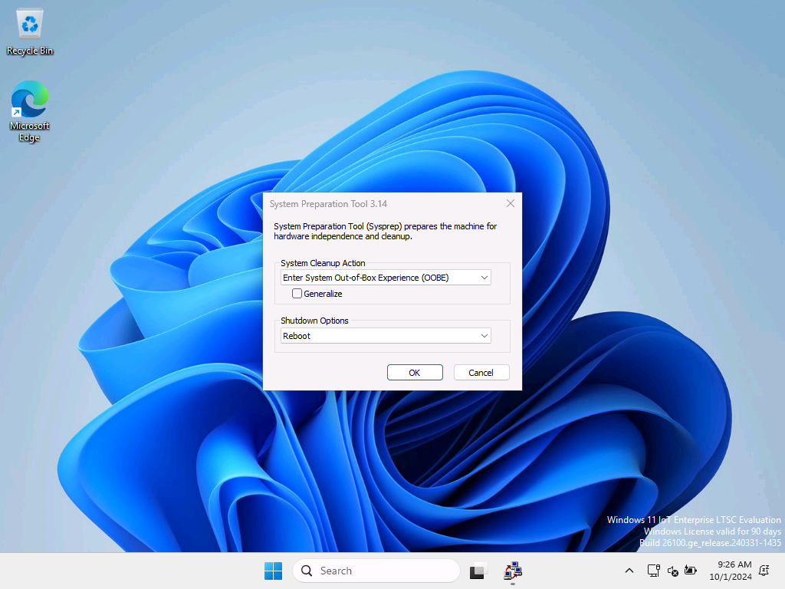
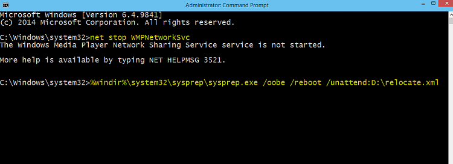
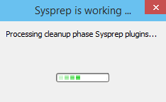

요즘 많은 프로그램들이 Program Files 혹은 Program Files(x86)이 아닌 **C:\Users\계정명** 폴더에 자료를 저장합니다.  

이런 저런 프로그램을 설치하다보니 용량이 30GB 를 넘어갑니다.   
윈도우 재설치하면서 사용자 폴더 위치를 C:\Users -> D:\Users 로 설정하는 방법을 적용했고, 여러 프로그램을 설치했는데 특별한 문제가 없는 듯 해서 소개합니다.  
윈도우 설치 후에도 가능한 것 같지만, 아무래도 클린 설치할 때 설정하면 좋겠지요.  
VHD(X) 에도 잘 적용되고 10/11 모두 가능합니다.  

> [!Infomation|hide]
> 참고사이트  
> https://www.tenforums.com/tutorials/1964-move-users-folder-location-windows-10-a.html

### 윈도우 설치 과정  

아래 예시는 <mark>C:\Users -> D:\Users</mark> 입니다.  

1. 설치 과정에서 아래와 같은 지역 선택 창을 만나면 <kbd>Ctrl</kbd>+<kbd>Shift</kbd>+<kbd>F3</kbd> 키를 누릅니다.  

    

2. 감사 모드(Audit Mode)로 부팅됩니다. 취소 버튼을 눌러 팝업창을 닫습니다.   
    참고로 네트워크 가능하므로 Edge 열어서 검색할 수 있습니다.  

    

3. 시작 버튼 우클릭 -  **디스크 관리**를 열고 드라이브(파티션) 문자를 확인합니다.  Users 폴더가 위치할 드라이브(파티션)의 드라이브 문자가 예상했던 것과 다르다면 변경합니다.  

4.  메모장을 열고, 아래 내용으로 UTF-8 형식인 무인 응답 파일(relocate.xml)을 만들고 C:\가 아닌 다른 드라이브에 저장합니다.   
    Users 폴더의 위치를 다른 곳으로 하고 싶으면 **D:\Users**  부분을 수정합니다.  

    ```xml file="relocate.xml"  
    <?xml version="1.0" encoding="utf-8"?>
    <unattend xmlns="urn:schemas-microsoft-com:unattend">
    <settings pass="oobeSystem">
    <component name="Microsoft-Windows-Shell-Setup" processorArchitecture="amd64" publicKeyToken="31bf3856ad364e35" language="neutral" versionScope="nonSxS" xmlns:wcm="http://schemas.microsoft.com/WMIConfig/2002/State" xmlns:xsi="http://www.w3.org/2001/XMLSchema-instance">
    <FolderLocations>
    <ProfilesDirectory>D:\Users</ProfilesDirectory>
    </FolderLocations>
    </component>
    </settings>
    </unattend>  
    ```

5. 관리자 권한으로 명령 프롬프트 (CMD) 실행한 뒤 아래 명령어를 차례로 실행합니다.  
    relocate.xml 파일을 D:\ 가 아닌 다른 위치에 저장했으면 수정합니다.  

    ```
    c:\windows\system32> net stop wmpnetworksvc  

    c:\windows\system32> %windir%\system32\sysprep\sysprep.exe /oobe /reboot / unattend:d:\relocate.xml
    ```

    

6. 아래와 같은 창이 뜨고 에러 없이 재부팅되면 끝입니다.  남은 설치 과정을 진행합니다.  
  
    

    만약 에러창이 뜨면 relocate.xml 파일의 위치, 저장 형식 (UTF-8)을 살펴보거나, 원문 사이트의 코드를 사용해보세요.  


> [!TIP|hide]
> 설치 후 탐색기에서 OneDrive 를 클릭해도 아무런 반응이 없으면 다음 글을 참고하세요.  
> <a href="/explorer-onedrive-fix" target="_blank" rel="noopener noreferrer">
탐색기 원드라이브  폴더를 클릭해도 아무런 반응이 없을 때</a>  