카시오 계산기 fx-570CW 모델의 파우치입니다.  
흔히 볼 수 있는 PVC 가죽 소재입니다.  

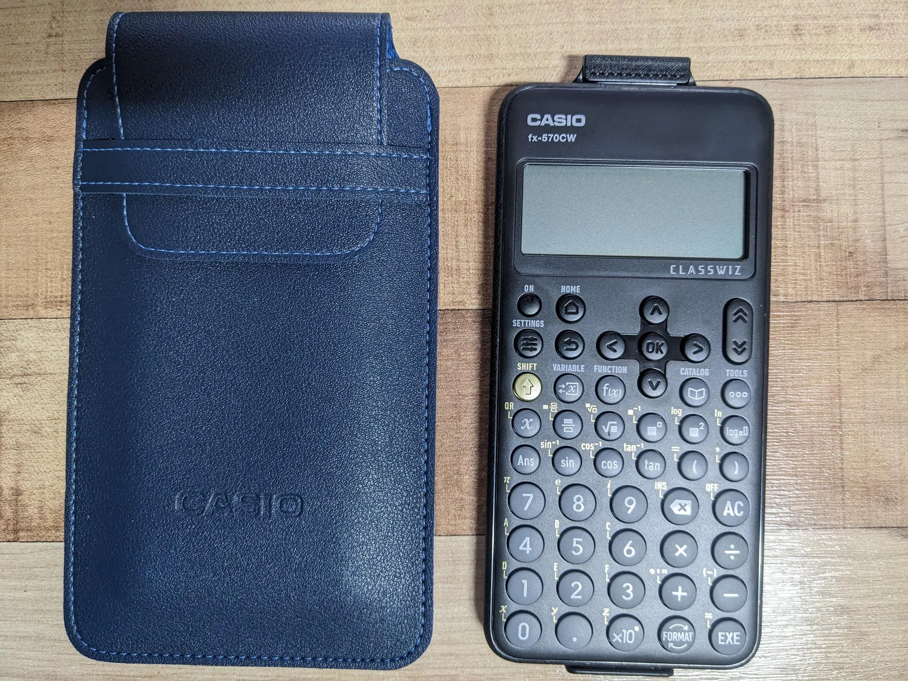

덮개를 넣고 빼는 것이 좀 귀찮은 형태라 스냅 단추를 달아보기로 했습니다.  

결과는?

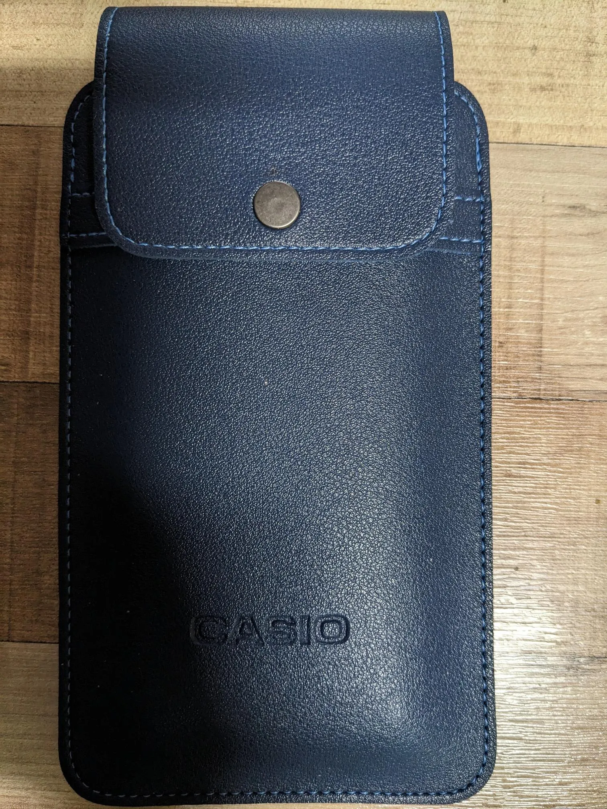  | 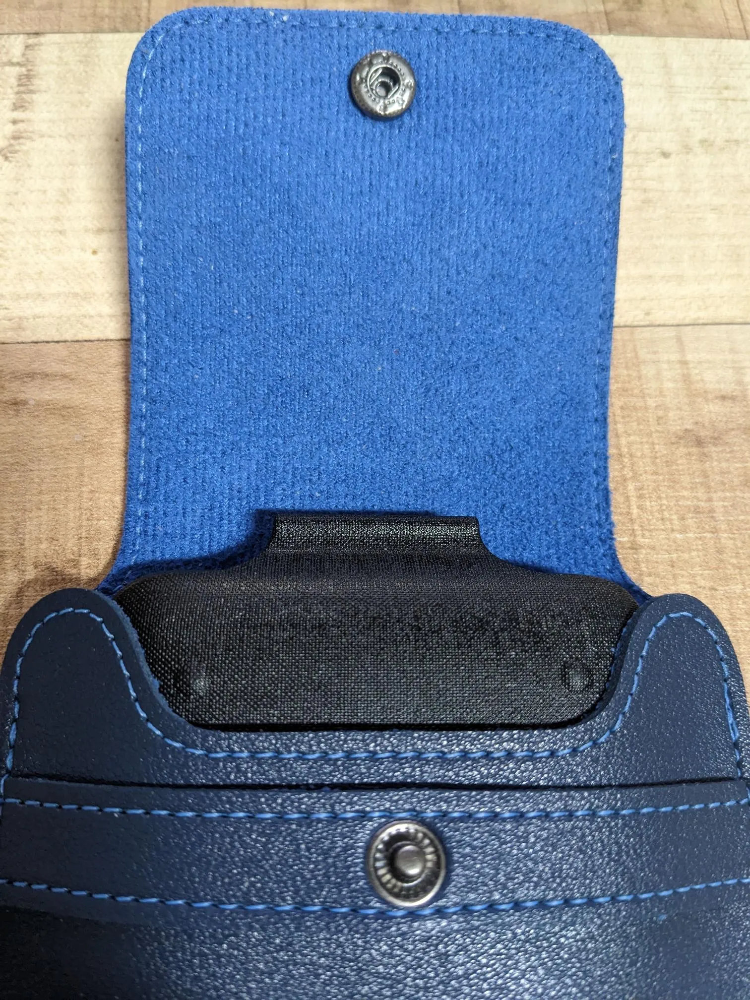 
--- | ---

아래는 결과까지의 과정입니다.  

--- 

위와 같이 생긴 단추에 대해서 검색을 하다보니 이런저런 단추의 종류와 단추 세상(?) 돌아가는 분위기도 조금 알게 되었습니다.  
그런데 이런 단추를 부르는 명칭이 제각각이네요.  
똑딱간추, 스냅단추, 스프링도트 단추 등등  
**스프링 스냅 단추**가 정식 명칭인 것 같습니다.  

최대한 돈을 적게 쓰고 싶으면 아래와 같이 직접 망치로 고정하는 **스냅 도구 세트**를 사용하는 것 같습니다.  
단추 크기에 따라 도구도 사이즈에 맞게 세트로 필요합니다.  

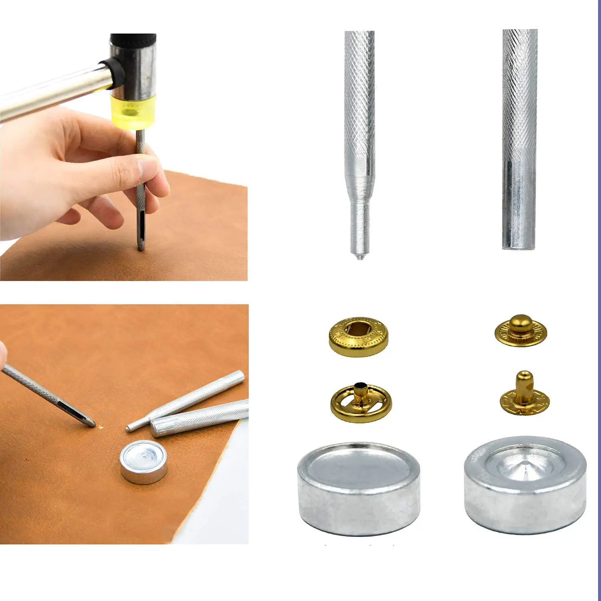  

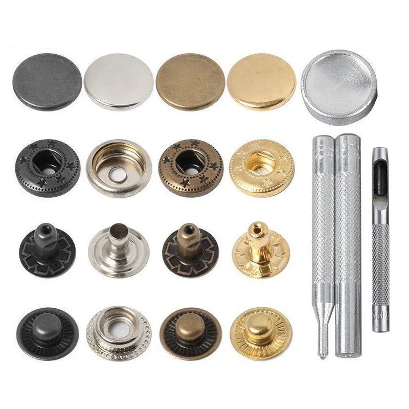  

\
단추를 달 일이 많거나 조금 전문적으로 하려면 아래와 같은 **프레스형 스냅기**를 사용하네요.  
프레스형도 가격이 그다지 비싸진 않지만 공간을 차지한다는 단점이 있습니다.  

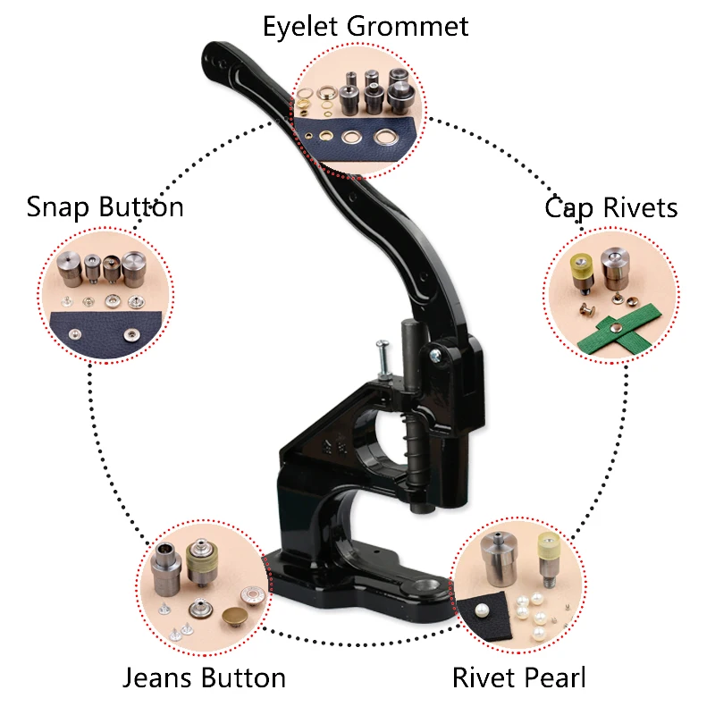

\
그래서 망치를 사용하는 아래의 **스냅 버튼 도구 세트**를 알리에서 구매했습니다.  

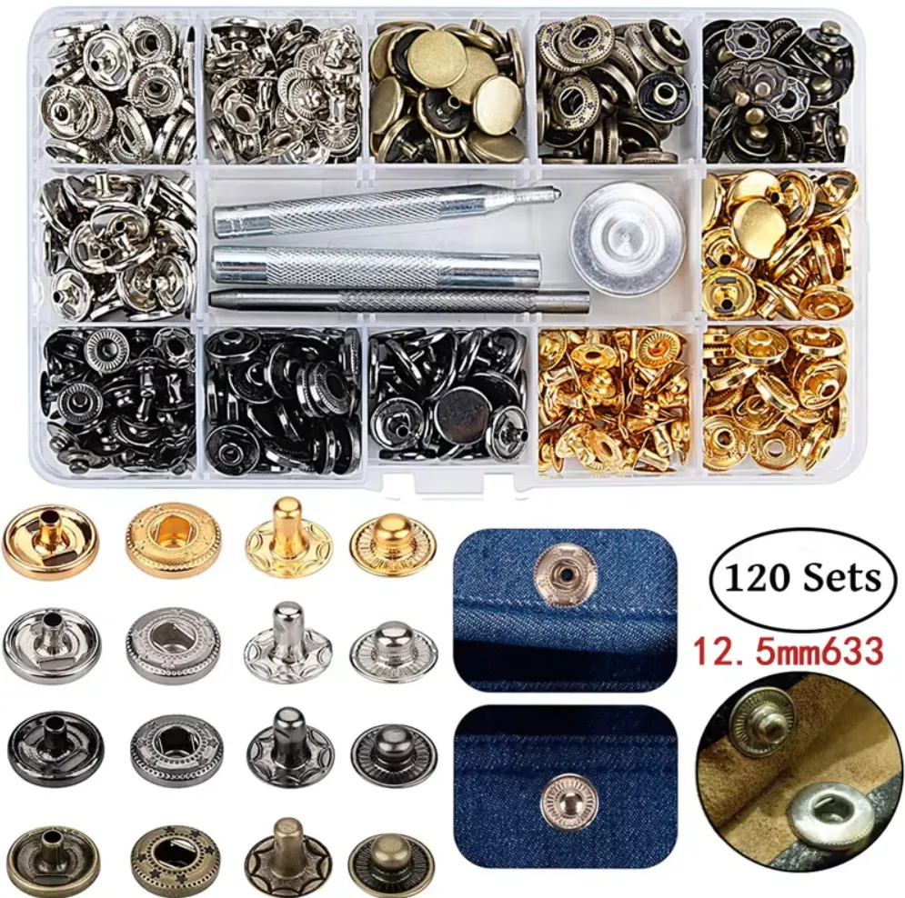

\
소감은? **이래저래 쉽지 않다.**  
네이버 카페에서 많은 사람들이 프레스형 스냅기를 추천하는 이유를 알게 됩니다.  

\
하지만 프레스형은 부담스러워서 핸디형 스냅기로 눈을 돌립니다.  
핸디형은 사용하시는 분들의 실제 경험을 찾기가 어렵네요.  
알리에서 아래와 같은 <mark>핸디형 스냅기 세트</mark>를 또 구매해봅니다.  

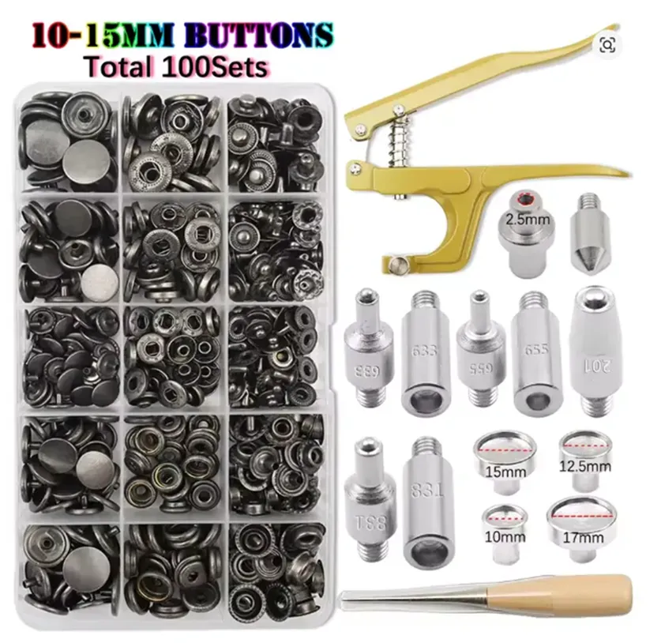
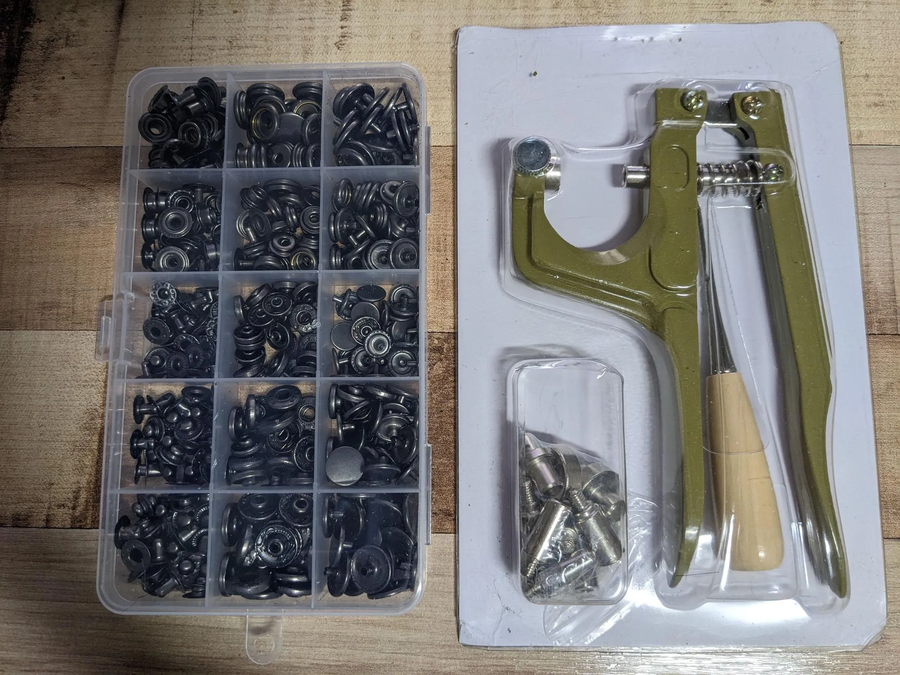

\
두꺼운 종이에 연습을 해보니 한 번에 잘 됩니다.  

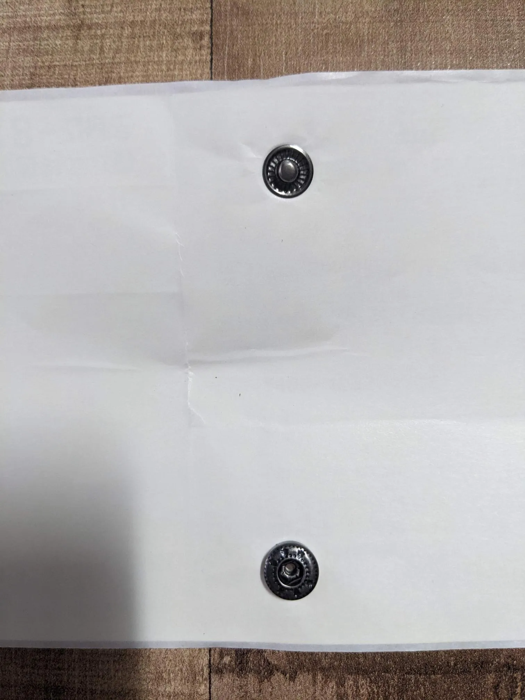  

\
결과는?  **아주 좋다.**  
마치 처음부터 달려있었던 것 같은 느낌입니다.  
단추의 크기는 이런 단추 중 가장 작은 10mm 짜리입니다.  

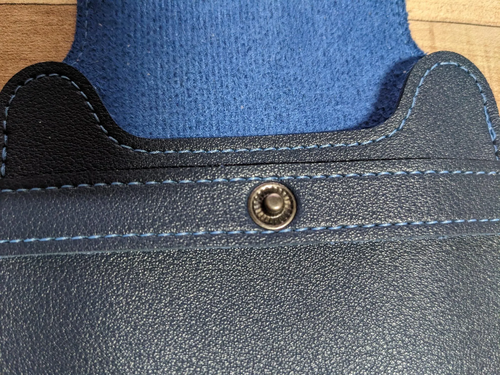  
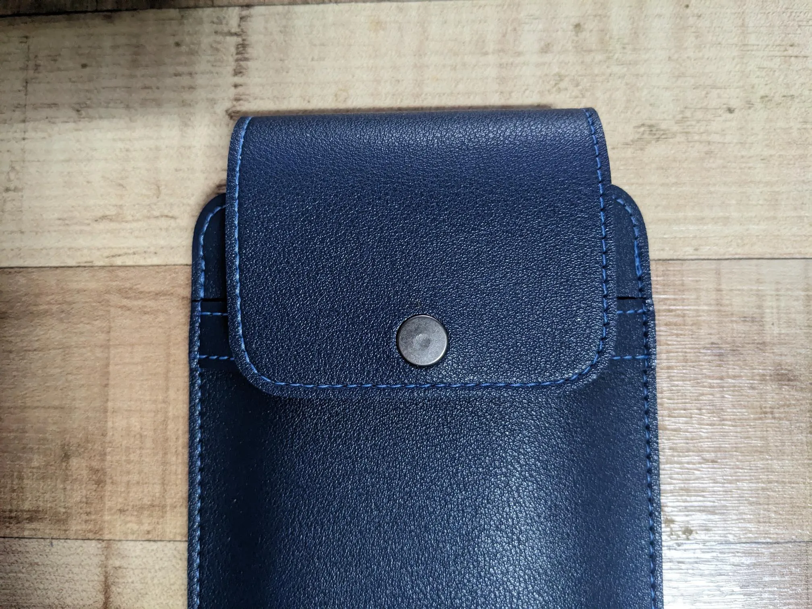  

이런 스냅기 하나면 장바구니, 가방, 옷, 기타 여러 용도로 똑딱이 단추를 아주 쉽게 달 수 있겠습니다.  
이 스냅기로 위와 같은 파우치나 가방에 단추를 달지 못하면 '나는 어마어마한 똥손이구나' 할만큼, 그 정도로 쉽습니다.  