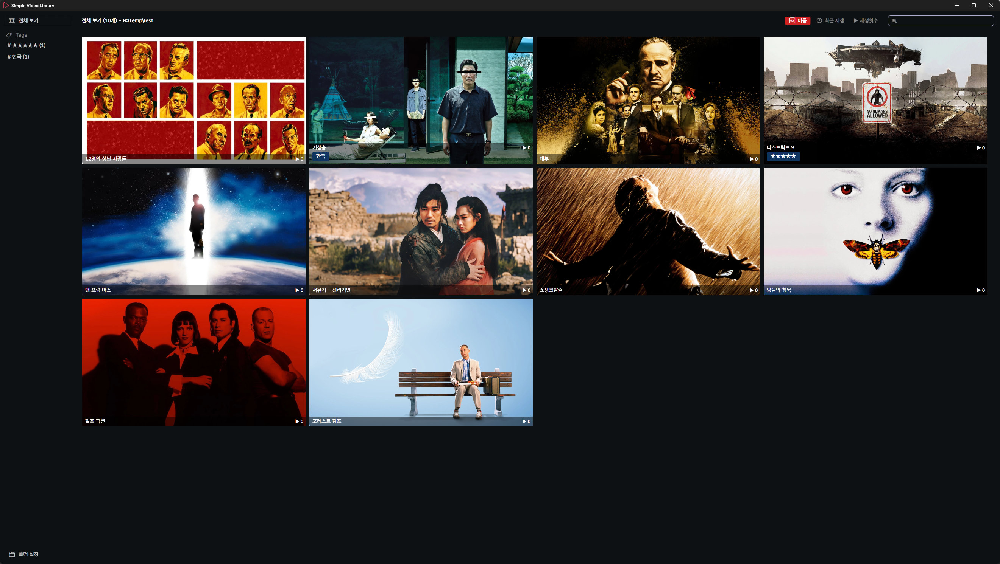

유명한 영화들로 구성한 예시 화면입니다.  
간단해서 사용방법 설명할 것도 없습니다.  
여러 영상 관리 프로그램이 있는데, 너무 무겁고 용량이 크고 쓰지 않는 기능이 많아서 그냥 단순하게 claude로 만들었습니다.  

딱 하나 조건이 있습니다.  
이미지 파일이 없다면 빈 이미지가 표시되는데, 이것과 별개로 영상과 이미지 파일은 루트 폴더가 아닌 루트 폴더 아래 각각의 개별 폴더에 담겨져 있어야 합니다. 아래와 같은 구조입니다.  
한 폴더에 수백개의 영상과 이미지를 다 때려넣어도 알잘딱 불러오도록 만들 수 있지만, 그렇게 관리하는 것 자체가 문제이므로 각각의 영상은 각각의 폴더에 따로 관리합시다.  

```
Temp/test  
      ├── 📁 기생충  
      ├── 📁 대부
      └── 📁 12명의 성난 사람들

```


### 장점
- 속도 빠름 (프로그램 실행, 리스트 이미지 크기 변경, 마우스 휠 스크롤, 검색 등)  
- 전체 프로그램 크기 매우 작음 (DB 포함 3MB 이하)
- 환경설정을 레지스트리가 아닌 해당 폴더 settings.json 파일에 기록  

### 단점
- Windows 11 전용 (10에 .net 최신 버전이 설치되어 있다면 가능할지도)
- 영상 개수가 1000 단위가 넘어갈 상황을 아직 고려하지 않음  
- 4K UHD 배율 100%가 아닌 다른 해상도 테스트 부족  

> [!tip|hide]
> library.db 파일에 파일 목록, 태그, 재생횟수, 최근 재생 기록 등 저장됩니다.  
> 전체 정보를 초기화하고 싶은 경우 이 파일을 삭제하거나 초기화 버튼을 사용하고, 각각의 태그/이미지/정렬 버튼을 우클릭해서 개별 편집/삭제할 수도 있습니다.  
>  
> settings.json 파일에 창크기, 이미지 크기, 창위치가 저장됩니다.  
>  
> 전체 보기 버튼은 새로고침의 역할도 겸합니다.  

<br>  

---
**2026-05-29**  
- 설정 초기화 추가  
- 폰트 변경 기능 추가  
- 키보드 위/아래 이동 시 화면 구성에 따라 다른 이미지가 선택되던 문제 해결  
- 팝업창 테마 통일  

**2026-05-28**  
- 각 영상과 태그 리스트 우클릭 메뉴로 태그 수정 가능  
- 이미지 사이의 간격 축소  
- 태그가 길어서 짤릴 경우 ... 말줄임표 표시 (마우스 오버로 전체 툴팁 표시)  
- 아무것도 선택하지 않은 상태에서 Enter 키를 누를 경우 첫번째 영상이 재생되던 문제 해결  
- 우클릭 메뉴 다듬기  
- 중복 코드 제거 및 최적화  

**2026-05-27**  
- 첫 배포


[Simple Video Library (구글 드라이브)](https://drive.google.com/uc?export=download&id=1g_H8ZXs9abTnjndClZTOjRm7XIj27EjD)
