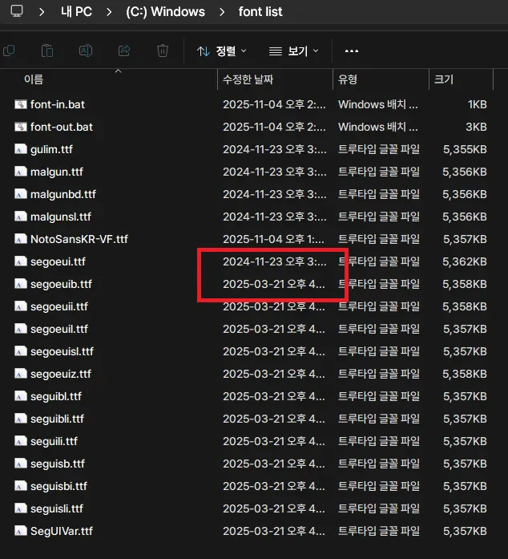
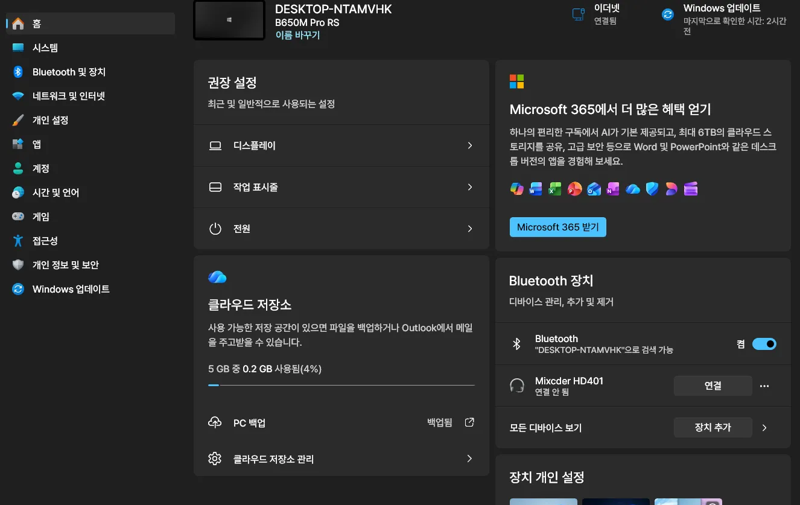

윈도우 11 기본 폰트인 맑은 고딕을 변경하기 위한 방법을 검색해보면 아래처럼 여러가지 방법을 확인할 수 있습니다.  
1. No!! MeiryoUI 프로그램을 이용하는 방법
3. 레지스트리를 수정하는 방법
3. 맥타입을 설정하는 방법

커뮤니티에 폰트 변경에 대한 정보글이 올라오면 많은 사람들이 적용해보고 경험담을 남기는데 전부 장단점이 있습니다.  100% 완벽한 방법은 아직 나오지 않았습니다.  

하지만 이 방법은 전체적인 원리를 생각해보면 사실상 부작용이 없는 수준입니다.  
>맑은 고딕 등 윈도우 내장 폰트의 정보를 빼내서 원하는 폰트에 덮어씌운 후 Windows\Fonts 폴더에서 맑은 고딕 등 여러 폰트를 제거하고 수정한 폰트들을 다시 Windows\Fonts 폴더에 집어넣는 방식입니다.  

아래 내용이 길어 보이지만 실제 작업은 오래 걸리지 않습니다.  

<a href="https://meeco.kr/Review/40907913" target="_blank" rel="noopener noreferrer">
<mark>원글</mark></a>을 참고하셔도 되고 <a href="/ttfname3" target="_blank" rel="noopener noreferrer">
<mark>ttfname3</mark></a>이라는 간단한 프로그램을 이용해 본인만의 폰트를 만들어도 됩니다.  

> [!DANGER|hide]  
> 항상 폰트의 저작권을 확인하세요. 

위의 원글에서 다운받은 압축파일을 풀어보면 폰트 파일이 1개가 아닌데, 이유는 맑은 고딕(malgun.ttf) 1개가 아닌 여러 개의 파일을 교체해야 되기 때문입니다.  
원글의 작성자분이 최대한 테스트하신 것으로 생각하고, 저도 한달 정도 실사용중인데 문제점은 없었습니다. 

혹시 문제가 생길 경우 복구하는 방법도 간단하고 레지스트리 걱정이 없습니다.  

원글에서는 맑은 고딕 두께별 3개와 Noto Sans KR, Segoe UI 폰트들을 <mark>Pretendard JP Medium</mark> (두께 500) 1가지로 통일한 것 같습니다.  이렇게 해도 두께별로 잘 표현되고 특별한 문제는 없었던 것 같습니다.  

### Pretendard JP의 단점

아래 스크린샷은 원글의 Pretendard JP로 설정한 결과인데 2024-11-23과 2025-03-21은 숫자별로 폭이 다르기 때문에 정확한 정렬이 안됨을 알 수 있습니다.  
  

저는 Pretendard JP보다는 Pretendard GOV가 정렬 문제를 포함해서 여러모로 국내 환경에 더 어울린다고 생각하기 때문에 GOV를 추천하고, 혹시 스스로 폰트를 수정하실 경우 두께는 아래처럼 하시면 될 것 같습니다.  
위에서 언급했듯이 전부 두께 500으로 해도 특별한 문제는 없어 보였는데, 오래 사용하면 어떤 일이 생길 지 모르니까 이왕 작업할 때 미리 해놓는 것이 좋다고 생각합니다. 시간 단위로 걸리는 작업도 아니니까요.

맑은 고딕 Semilight --> Pretendard GOV Regular (400)  
맑은 고딕 --> Pretendard GOV Medium (500)  
맑은 고딕 Bold --> Pretendard GOV Bold (700)  
Segoe UI Semilight --> Pretendard GOV Regular (400)  
Segoe UI --> Pretendard GOV Medium (500)  
Segoe UI Bold --> Pretendard GOV Bold (700)    
Noto Sans KR 은 그대로 유지합니다.  

### 작업 순서

1. 폰트 준비  
    <a href="https://meeco.kr/Review/40907913" target="_blank" rel="noopener noreferrer">
<mark>원글</mark></a>을 참고하시거나 <a href="/ttfname3" target="_blank" rel="noopener noreferrer">
<mark>ttfname3</mark></a>를 이용해서 본인만의 폰트를 만듭니다.  

2. c:\ 에 font list 폴더와 파일들을 넣어줍니다.  
  font-out.bat, font-in.bat 파일을 내용을 확인해보세요.  
  필요한 파일의 권한을 획득해서 빼내고, 준비한 파일을 폰트 폴더로 복사하는 명령어를 확인할 수 있습니다.

3. <mark>안전모드 (명령 프롬프트 사용)</mark> 으로 부팅  
      <kbd>Shift</kbd>키를 누른 상태에서 다시 시작 --> 문제 해결 --> 시작 설정 --> 다시 시작 

4. c:\windows\system32> <mark>cd c:\font list</marK>  
  c:\windows\system32 --> c:\font list 로 이동

5. c:\font list> <mark>font-out.bat</marK>  
  Windows\Fonts 폴더에 있는 교체할 폰트들을 c:\ 로 빼냅니다.  

6. c:\font list> <mark>font-in.bat</mark>  
  준비한 폰트들을 Windows\Fonts 폴더로 복사합니다.   

7. <mark>shutdown /r /t 0</mark>  혹은 <kbd>Ctrl</kbd>+<kbd>Alt</kbd>+<kbd>Del</kbd>  
  시스템 재시작

### 결과 확인

  

맑은 고딕 포함 기존 한글폰트가 교체한 폰트로 보인다면 작업이 잘 끝났습니다.  

### 복구 방법

c:\ 를 확인해보면 font-out.bat 으로 빼낸 여러 개의 원본 ttf 폰트가 있을텐데 이 폰트들을 2개의 .bat 파일과 함께 따로 보관해두세요.  
전체 작업의 원리를 알았으니 혹시 부작용이 생기거나 원래대로 되돌리고 싶은 경우 보관한 폰트들을 동일하게 c:\font list 로 복사해서 위 과정을 진행하면 원래대로 복구됩니다.  

### 참고

기억하세요.  
이제 각각의 프로그램에서 폰트가 '맑은 고딕'으로 설정되어 있어도 그 폰트는 수정된 폰트입니다.

> 하지만 100% 완벽하지는 않습니다.  
> 윈도우 내장 메모장 등 일부 프로그램은 맑은 고딕으로 설정되어 있어도 글자가 깨질 수 있으므로 해당 프로그램의 설정에서 직접 다른 폰트로 변경해야 합니다.  

폰트의 두께가 500이라서 눈에 딱 들어오지만 맑은 고딕에 비해 아주 살짝 작아보이는 느낌이 들 수 있습니다.  
디스플레이 배율을 25% 단위로 변경하기보다 <mark>설정-접근성-텍스트 크기</mark>에서 글자 크기를 1% 단위로 조절해보세요.

새로운 메모장은 어떤 폰트로 변경해도 글자 크기가 작으면 깨끗하게 나오질 않네요.  
<a href="https://github.com/zufuliu/notepad4" target="_blank" rel="noopener noreferrer">
Notepad4</a> 한 번 써보세요.  