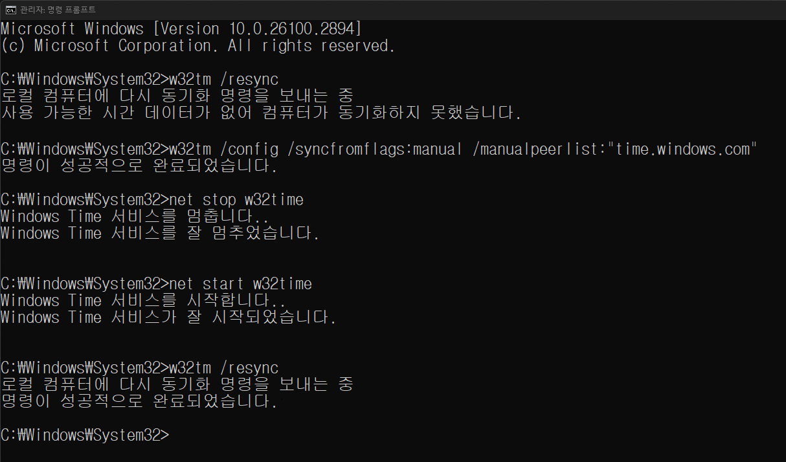

리눅스와 윈도우 간의 멀티부팅으로 인한 시간 오차는 리눅스에서 해결하면 되고  
그 외 잘 해결되지 않는 상황에서 아래 방법을 한 번 써봅니다.  

명령 프롬프트(CMD)를 열고  `w32tm /resync`

```
C:\Windows\System32\w32tm /resync
로컬 컴퓨터에 다시 동기화 명령을 보내는 중
사용 가능한 시간 데이터가 없어 컴퓨터가 동기화되지 못했습니다.
```
해보면 아마 위처럼 오류 메세지가 나올겁니다.  

아래 과정을 따라합니다. 명령어는 복사/붙여넣기 하세요.  
참고로 명령 프롬프트 창에서 Ctrl+마우스 휠 업/다운하면 글자 확대/축소 됩니다.  
```
C:\Windows\System32\w32tm /config /syncfromflags:manual /manualpeerlist:"time.windows.com"
명령이 성공적으로 완료되었습니다.

C:\Windows\System32\net stop w32time
Windows Time 서비스를 멈춥니다..
Windows Time 서비스를 잘 멈추었습니다.

C:\Windows\System32\net start w32time
Windows Time 서비스를 시작합니다..
Windows Time 서비스가 잘 시작되었습니다.

C:\Windows\System32\w32tm /resync
로컬 컴퓨터에 다시 동기화 명령을 보내는 중
명령이 성공적으로 완료되었습니다.
```

재부팅 후 확인해봅니다. 바탕화면 보인 후 sync까지 몇 초 정도 시간이 필요할 수 있으니 조금 기다립니다.

  