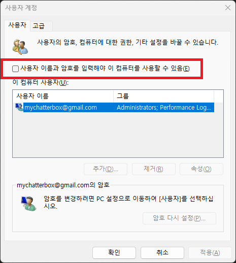
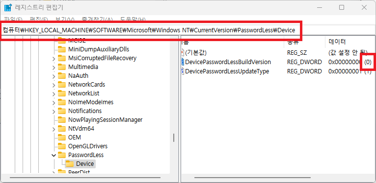

지긋지긋한 윈도우 자동 로그인 설정.  
해도해도 까먹습니다.  
용케 netplwiz 를 기억해내서 실행했는데 상단 메뉴가 안 보이는 상황.  
일단 netplwiz 창을 닫습니다.



레지스트리 편집기 (실행 - `regedit`) 실행 후

```
컴퓨터\HKEY_LOCAL_MACHINE\SOFTWARE\Microsoft\Windows NT\CurrentVersion\PasswordLess\Device
```

위 경로 직접 찾아가지 말고 <mark>복사</mark>해서 <mark>상단 위치에 붙여넣으면</mark> 해당 위치로 <mark>바로 이동</mark>합니다.



우측 리스트에 `DevicePasswordLessBuildVersion` 항목이 없으면 만들고 더블클릭 `0`으로 수정 후 다시 `netplwiz` 실행합니다.
