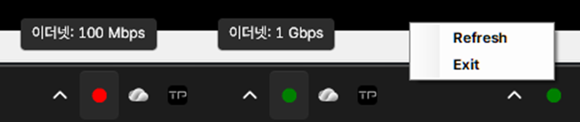

<mark>집계된 링크 속도(수신/전송)   100/100(Mbps)</mark>

아오!

가끔 인터넷 속도가 느리거나 반응이 굼뜨다 싶어서 이더넷 상태를 살펴보면 링크 속도가 1G -> 100M 으로 변경되어 있습니다.  
주로 케이블 문제인 것 같고 공유기 문제일 수도 있는데, 해결이 되는가 싶다가도 어느새 100M 되어 있고...

설정-네트워크 및 인터넷 들어가서 매번 확인하기도 귀찮고, 네트워크 모니터링 프로그램까지는 필요없어서 간단한 스크립트로 해결할까 합니다.

ethernet-check.vbs 파일을 실행하면, ethernet-check.ps1 파워쉘 스크립트가 실행되고 시스템 트레이에 현재 상태를 보여주는 아이콘과 툴팁이 표시됩니다.  
실행 즉시 현재 상태를 한 번 체크하고 이후 60초마다 체크합니다.  
체크 주기를 변경하려면 아래 부분을 수정하세요.  

`$timer.Interval = 60000`

우클릭 메뉴로 링크 속도를 바로 변경할 수 있다면 좋겠지만, 파워쉘 스크립트만으로는 불가능한 것 같습니다.  



```ps file="ethernet-check.ps1" 
Add-Type -AssemblyName System.Windows.Forms
Add-Type -AssemblyName System.Drawing

# 트레이 아이콘 생성
$notifyIcon = New-Object System.Windows.Forms.NotifyIcon
$notifyIcon.Visible = $true

# 우클릭 메뉴 생성
$menu = New-Object System.Windows.Forms.ContextMenuStrip

# Refresh 메뉴
$refreshItem = $menu.Items.Add("Refresh")
$refreshItem.add_Click({
    Check-Speed
})

# Exit 메뉴
$exitItem = $menu.Items.Add("Exit")
$exitItem.add_Click({
    $notifyIcon.Visible = $false
    $notifyIcon.Dispose()
    [System.Windows.Forms.Application]::Exit()
    exit
})

$notifyIcon.ContextMenuStrip = $menu

function Update-Icon($state, $tooltipText) {
    $bmp = New-Object System.Drawing.Bitmap 32,32
    $graphics = [System.Drawing.Graphics]::FromImage($bmp)
    $graphics.Clear([System.Drawing.Color]::Transparent)

    switch ($state) {
        "Normal" { $brush = [System.Drawing.Brushes]::Green }
        "Alert"  { $brush = [System.Drawing.Brushes]::Red }
        "NA"     { $brush = [System.Drawing.Brushes]::Yellow }
    }

    # 원 그리기
    $graphics.FillEllipse($brush, 4, 4, 24, 24)

    $icon = [System.Drawing.Icon]::FromHandle($bmp.GetHicon())
    $notifyIcon.Icon = $icon
    $notifyIcon.Text = $tooltipText   # 마우스 오버 시 표시되는 툴팁

    $graphics.Dispose()
}

function Check-Speed {
    $adapter = Get-NetAdapter | Where-Object { $_.Status -eq "Up" -and $_.MediaType -eq "802.3" } | Select-Object -First 1
    if ($adapter) {
        $speed = $adapter.LinkSpeed
        if ($speed -match "(\d+)\s*(Gbps|Mbps)") {
            $value = [int]$matches[1]
            $unit = $matches[2]
            $tooltip = "$($adapter.Name): $speed"

            if (($unit -eq "Mbps" -and $value -le 100) -or ($unit -eq "Gbps" -and $value -lt 1)) {
                Update-Icon "Alert" $tooltip
            } else {
                Update-Icon "Normal" $tooltip
            }
        } else {
            Update-Icon "NA" "Speed: N/A"
        }
    } else {
        Update-Icon "NA" "No adapter detected"
    }
}

Write-Host "Starting Ethernet Link Speed Tray Monitor..."
Write-Host "Right-click tray icon for Refresh or Exit."

# 실행 직후 한 번 체크
Check-Speed

# 타이머로 주기적 체크 (60초마다)
$timer = New-Object System.Windows.Forms.Timer
$timer.Interval = 60000
$timer.Add_Tick({ Check-Speed })
$timer.Start()

# 메시지 루프 실행 (메뉴 이벤트 처리)
[System.Windows.Forms.Application]::Run()
```

```vbs file="ethernet-check.vbs"
Set objShell = CreateObject("Wscript.Shell")
objShell.Run "powershell.exe -ExecutionPolicy Bypass -File ""D:\programs\all\network\ethernet-check.ps1""", 0, False
```


> [!important|hide]
> ""D:\programs\all\network\ethernet-check.ps1""
>
> ethernet-check.ps1 파일의 위치에 맞게 주소를 수정하세요.  