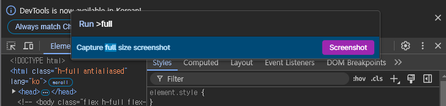
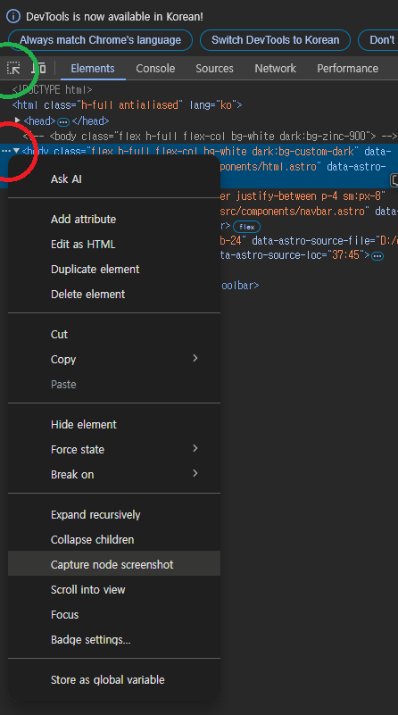

기본적인 방법  

  

캡쳐할 페이지에서 `F12` 키를 눌러 크롬 개발자 도구를 실행합니다.  
`Ctrl + Shift + P` 를 눌러 Run 실행창을 띄운 뒤  
`full` 혹은 원하는 단어로 검색, Capture full size screenshot 명령어를 선택하면 전체 스크롤 화면이 png 파일로 받아집니다.

크롬 개발자 도구(F12)를 실행하면, 기본적으로 Elements 탭의 **<body** 부분이 선택됩니다.  
`빨간 원` 부분의 `…▼` 클릭 후 `Capture node screenshot` 을 선택하면 전체 화면이 png 파일로 다운됩니다.

  

이 방법을 응용해서 현재 페이지의 특정 부분을 깔끔하게 캡쳐(다운)할 수 있습니다.  
`녹색 원` 부분의 화살표를 클릭한 뒤 페이지에서 `캡쳐할 부분을 마우스로 선택`합니다.  
원하는 요소를 선택하고, `…▼` 클릭 후 `Capture node screenshot` 을 선택하면 해당 부분만 깔끔하게 다운(캡쳐)할 수 있습니다.