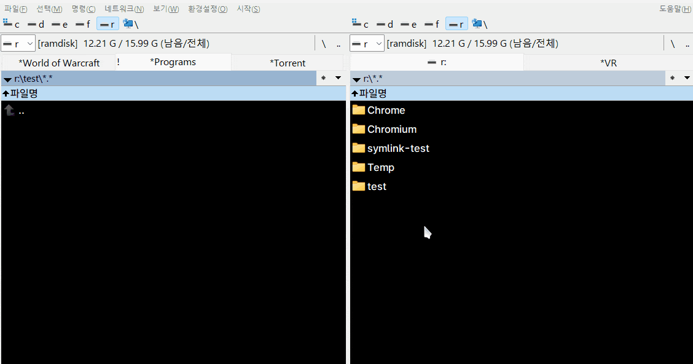

토탈커맨더에서 개인 명령어를 추가하고 메뉴에 등록해서 사용하려면 우선 토탈커맨더 폴더에 usercmd.ini 파일을 만들고 명령어들을 넣은 다음, 이 명령어를 이용해 아이콘과 연결해 사용하거나, 시작 메뉴에 등록해야 합니다.

등록해서 사용중인 화면을 먼저 확인해봅니다.


아래는 예시 코드입니다. (usercmd.ini 안에 들어갈 내용)  
버튼(아이콘)을 등록해서 이용할 경우 button 부분을 적절히 수정합니다.

```ini
[em_ext_symlink]
cmd=em_ext_symlink2text1, em_ext_symlink2text2
menu=Make directory or file symlink in the opposite panel for selected files
button=%COMMANDER_PATH%\WCMICON2.DLL,65
iconic=1

[em_ext_symlink2text1]
cmd=_%COMSPEC% /C
param=@for /f "usebackq tokens=_" %%i in ("%F") do @( if exist "%P%%~i\" ( mklink /D "%T%%~i" "%P%%~i" ) else ( mklink "%T%%~i" "%P%%~i" ) )
menu=Make directory or file symlink in the opposite panel for selected files
button=%COMMANDER_PATH%\WCMICON2.DLL,65
iconic=1

[em_ext_symlink2text2]
cmd=%COMSPEC% /C
param=if exist "%P" copy "%WL" "symbolic link.txt"
menu=Make symbolic link.txt
iconic=1
```

`em_ext_symlink` 라는 명령을 실행하면 `em_ext_symlink2text1`, `em_ext_symlink2text2` 라는 2개의 명령을 실행합니다.

`em_ext_symlink2text1` 부분은 심볼릭링크를 생성하는 명령이고  
`em_ext_symlink2text2` 부분은 원본 폴더나 파일의 주소가 기록된 symbolic link.txt 파일을 만들어줍니다.

현재 활성창(원본)의 파일이나 폴더를 선택한 상태에서 명령을 실행하면 반대쪽 비활성창에 심볼릭링크가 만들어지고 원본 폴더나 파일의 주소가 포함된 symbolic link.txt 파일을 만들어줍니다.

`em_ext_symlink2text2` 부분은 파일명을 수정해도 되고, 굳이 필요없다면 전체를 지워도 됩니다.

토탈커맨더의 시작 메뉴에 명령을 등록해서 사용하는 방법입니다.  
시작 메뉴에서 '항목 추가' 후 적절한 제목을 입력한 뒤 아래처럼 구성합니다.


