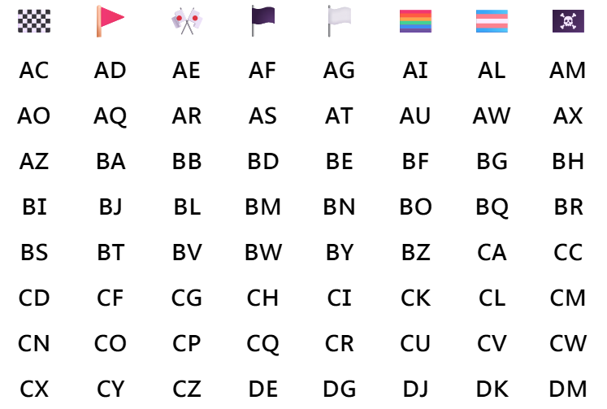
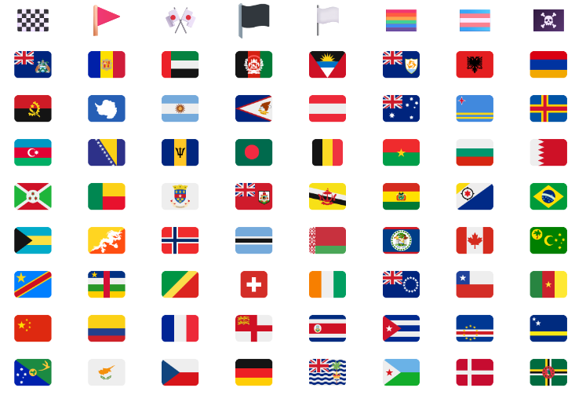
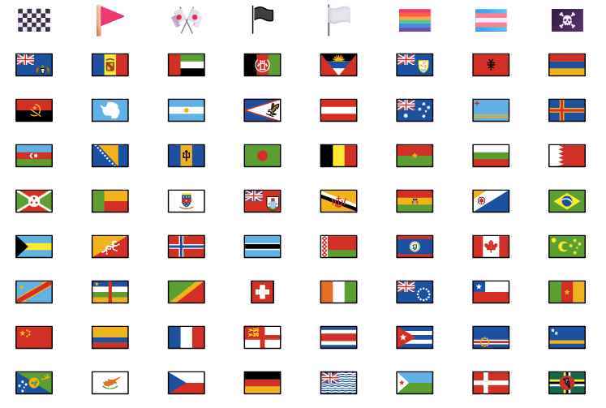
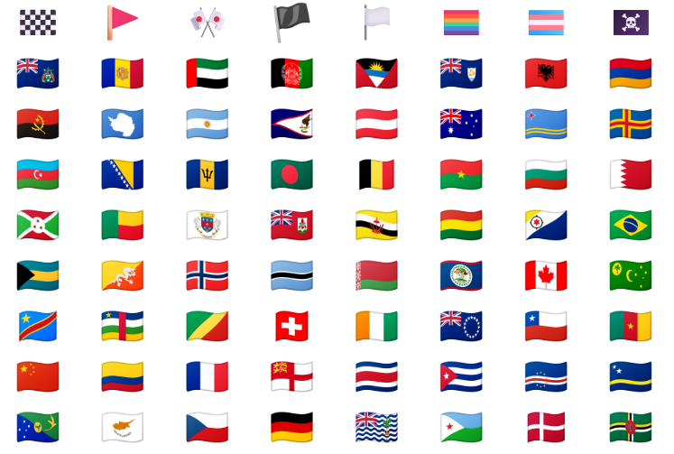
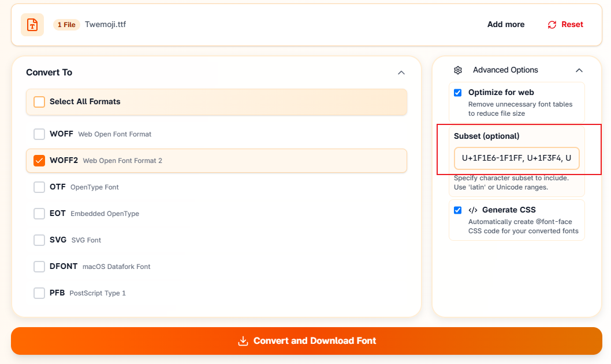

### 윈도우 + 크롬 브라우저  

윈도우와 크롬 브라우저의 조합에서는 폰트에 포함된 flag가 정상적으로 표시되지 않습니다.   
어느 정도 국제적인 정치 문제가 연관되어 있습니다.  
자세한 내용은 건너뛰고...




flag 이모지를 사용하기 위해 Twemoji, openmoji, NotoColorEmoji 와 같은 폰트를 전체 @import 하거나 stylesheet 으로 삽입하는 것은 큰 낭비이므로 flag 이모지만 분리한 폰트를 만들어서 사용해보겠습니다.  

### ttf 폰트 준비


유니코드 버전에 따라 flag가 추가([Sark](https://en.wikipedia.org/wiki/Flag_of_Sark))되거나 디자인이 바뀌기 때문에 2026년 6월 기준, 최소한 유니코드 16 이상 적용된 폰트를 사용하는 것이 좋습니다.  
아래는 공식 사이트의 원본 ttf 파일 링크이므로 다운 받아서 <mark>[직접 변환](http://chatter.kr/how-to-subset-flag-emoji#폰트-subsetting)</mark>  해야 합니다.  


- 가장 많이 쓰이는 이모지를 원하면 Twitter Emoji <mark>twemoji</mark> 를 선택합니다.  (변환 후 118KB)  
[twemoji.ttf (유니코드 16)](https://github.com/Sav22999/emoji/raw/refs/heads/master/font/twemoji.ttf)  

    

- 가장 용량이 작은 이모지를 원하면 <mark>OpenMoji</mark> 를 선택합니다. (변환 후 57.2KB)  
[OpenMoji.ttf (유니코드 17)](https://github.com/hfg-gmuend/openmoji/raw/refs/heads/master/font/OpenMoji-color-glyf_colr_0/OpenMoji-color-glyf_colr_0.ttf)  

  

- 가장 선명하고, 휘날리는 모양의 이모지를 원하면 <mark>NotoColorEmoji</mark> 를 선택합니다.  (변환 후 787KB)  
flag만 포함된 파일입니다.  
[NotoColorEmoji-flagsonly.ttf (유니코드 17)](https://github.com/googlefonts/noto-emoji/raw/refs/heads/main/fonts/NotoColorEmoji-flagsonly.ttf)   

    

### 폰트 subsetting  

.ttf 파일을 다운 받은 후 flag를 제외한 나머지 이모지를 제거하고, .woff2 형식으로 변환해야 합니다. 순서는 무관합니다.  
광고 팝업창이 자주 뜨지만 https://font-converters.com/ 사이트에서 서브셋 추출과 변환을 한 번에 할 수 있습니다.  
오른쪽 Subset (optional) 란에 flag만 추출하기 위해 flag 유니코드 범위를 입력하고 Convert and Download  합니다.  
```
U+1F1E6-1F1FF, U+1F3F4, U+E0062-E0063, U+E0065, U+E0067, U+E006C, U+E006E, U+E0073-E0074, U+E0077, U+E007F
```



### 추천 사이트

https://wakamaifondue.com/  

폰트의 여러가지 정보를 확인할 수 있습니다.  